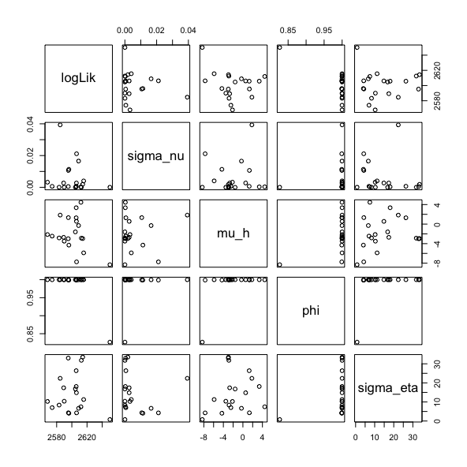
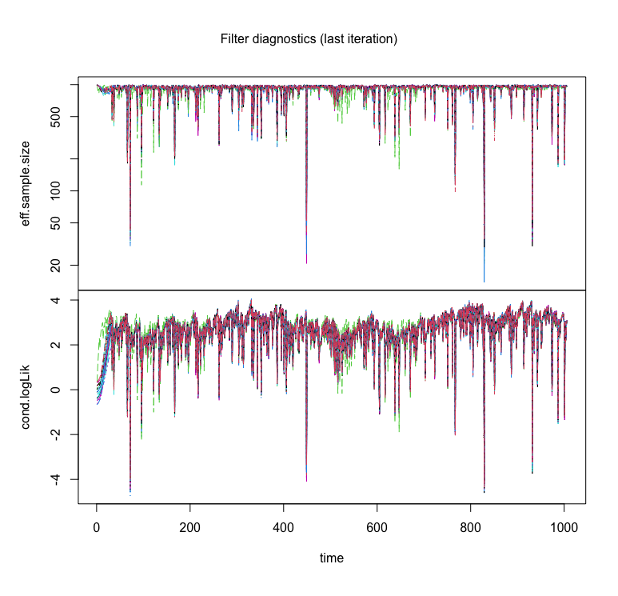
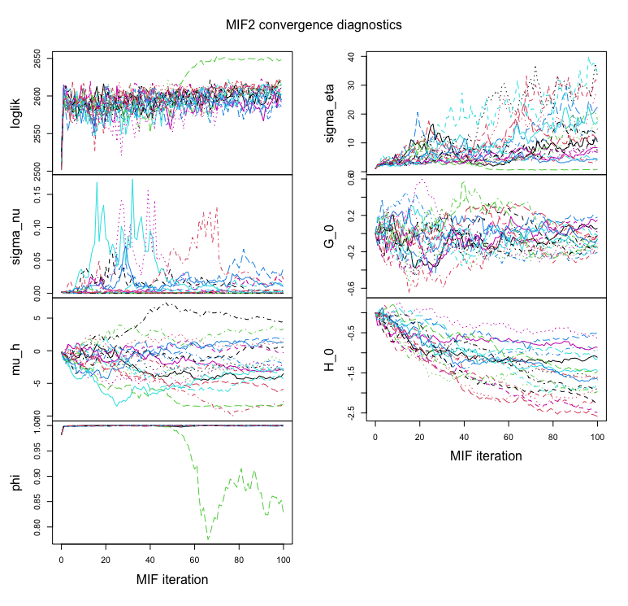
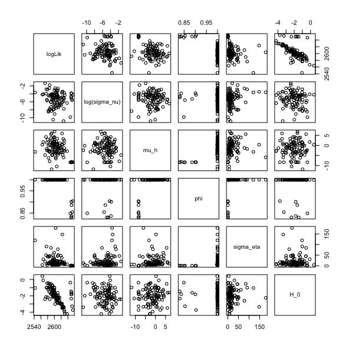
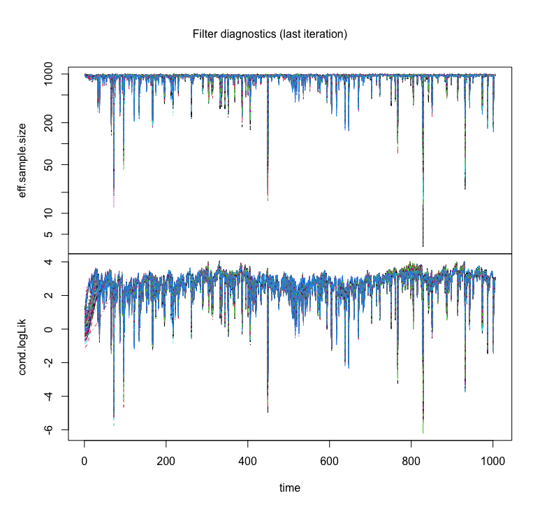
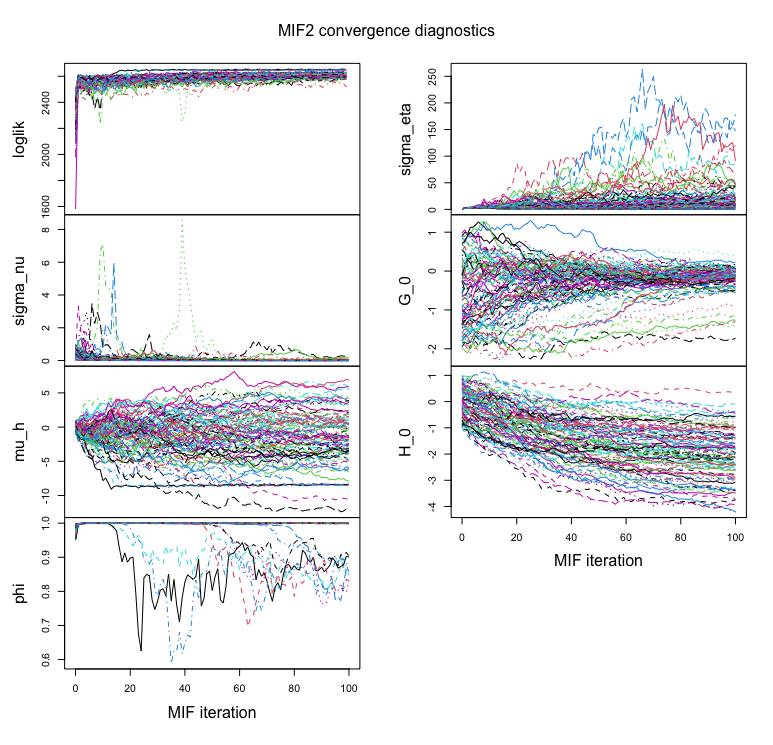

```{r setup, include=FALSE}
knitr::opts_chunk$set(echo = TRUE)
```

# Introduction

Apple Inc. is a globally renowned technology company headquartered in Cupertino, California, United States established in 1976, co-founded by Steve Jobs, Steve Wozniak, and Ronald Wayne. Its stock symbol is `AAPL` listed on the NASDAQ stock exchange. It is one of the largest technology companies all around the world, and its stock is popular among all investors. The price of its stock is affected by many factors like company performance, market competition and political policies. Therefore, it's meaningful to do some analysis on its stock price. In this report, we use data from Apr. 19, 2020 to Apr. 19, 2024. It is retrieved by package `quantmod` with source set to `yahoo`. We will mainly use ARIMA, GARCH and POMP to model the stock prices and assess their performances at last.

```{r, message=FALSE, warning=FALSE}
library(quantmod)

start_date <- "2020-04-19"
end_date <- "2024-04-19"

getSymbols("AAPL", src = "yahoo", from = start_date, to = end_date)

head(AAPL)

data_lreturn <- diff(log(AAPL$AAPL.Close))
data_lr <- na.omit(ts(data_lreturn, frequency = 253))
```

# Exploratory Data Analysis

```{r, message=FALSE, warning=FALSE}
plot(AAPL$AAPL.Close, type = "l")
plot(data_lr, main = "Log Return of AAPL Stock Price")
```

There is roughly a increase in its stock price from Apr. 2020 to Oct. 2021, and a short decrease until Apr. 2023, and increase again. From the plot of log return, one can find that the volatility of log return first decrease, then increase and decrease again. We then do some decompose work:

```{r, message=FALSE, warning=FALSE}
decompose_lr <- decompose(data_lr)
plot(decompose_lr)
```

```{r, message=FALSE, warning=FALSE}
acf(data_lr, main = "ACF of AAPL Log Return")
```


```{r, include = FALSE}

library(tidyverse)
library(tseries)
library(forecast)

```

# ARIMA Model
## Stationarity

Augmented Dickey-Fuller (ADF) Test is employed to exam the stationary. of a time series. It tests the null hypothesis that a unit root is present in a time series sample


<center> $H_0:$ there is a unit root in an AR model, which implies that the data series is not stationary. </center> <br>
<center> $H_1:$ there is not a unit root in an AR model, which implies that the data series is stationary.. </center> <br>


```{r}
# ADF test
suppressWarnings({
  adf_result <- adf.test(data_lr)
})

data.frame("Test Statistics"=adf_result$statistic, "P-value"=adf_result$p.value)
```
<center> Table 1. ADF Test Results </center> <br>

When using Augmented Dickey-Fuller (ADF) Test to exam stationarity on log return, it report waning: p-value smaller than printed p-value. If the computed statistic is outside the table of critical values, then a warning message is generated [1]. Therefore, p-value is less than 0.01 indicating rejection on null hypothesis leading summary that log return has stationary distribution.

## Seasonality From ACF

The ACF measures the correlation between the time series and its lagged values at different time lags. Significant peaks in the ACF plot at specific lags indicate periodic patterns in the data. If there are significant peaks at regular intervals it suggests seasonality.

```{r}
acf(data_lr, lag.max = 40, main = "ACF of AAPL Log Return")
```

Based on ACF plot, we do observe a peak at Lag 0.07 but there is only 1 peak which does not show at regular interval. Thus, we do not believe seasonality is present in log return.

## Noise Modeling

We wanted to develop a model for noise, since seasonality is not observed from Autocorrelation Function (ACF), and data show strong stationary, we decided to use the ARMA model to model the noise part. We will fit the $ARMA(p,q)$ model parameters. According to Chapter 4 lecture slides, we will obtain the following model. We use CatGPT [2] to write latex

$$Y_n=\phi_1Y_{n-1}+\phi_2Y_{n-2}+···+\phi_pY_{n-p}+\epsilon_n+\psi_1\epsilon_{n-1}+···+\psi_q\epsilon_{n-q}$$

where {$\epsilon_n$} is a white noise process. Using the back-shift operator, we can write this more succinctly as

$$\phi(B)Y_n= \psi(B)\epsilon_n$$

We decided to use grid search to choose the parameters of ARMA model. In ARMA models, the parameters p and q represent the non-seasonal order

- p is order of the auto-regressive part
- q is order of the moving average part

```{r}

p_values <- c(1:4)
q_values <- c(1:4)

param_grid <- expand.grid(p = p_values, q = q_values)

aic <- c()

# Perform grid search
for (i in 1:nrow(param_grid)){
  params <- param_grid[i, ]
  arma_model <- Arima(data_lr, order = c(params$p, 0, params$q))
  aic = append(aic,AIC(arma_model))
}

result <- data.frame(param_grid) |> mutate(AIC = aic)

result |> filter(AIC == min(AIC))
```


Diagnosing an ARMA model involves assessing the adequacy of the model by examining the properties of the residuals, which are the differences between the observed values and the values predicted by the model. The ARMA model assumes that the residuals are white noise, meaning they are independent, identically distributed, and have constant variance.


```{r}
arma_11 <- Arima(data_lr, order = c(1, 0, 1))

plot(resid(arma_11),ylab="Residuals",main="Residuals(ARMA(1,1)) vs. Time")
```


the residuals of an ARMA model are randomly distributed around zero but the variance is not constant, it suggests a violation of the assumption of constant variance, also known as homoscedasticity. We add model of variance to deal with homoscedasticity such as ARCH (Autoregressive Conditional Heteroscedasticity) or GARCH (Generalized Autoregressive Conditional Heteroscedasticity) models.

```{r}
acf(resid(arma_11), main = 'ACF of ARMA(1,1) Model residuals')
```


From the ACF plot, we observe a peak at Lag 0.07 which is the same peak showed at ACF plot of original data. We use Ljung-Box test to have a more stricted test about autocorrelation in model's residuals

<center> $H_0:$ all residuals 0 autocorrelation through time </center> <br>
<center> $H_1:$ at least 1 residual has non-zero autocorrelation through time </center> <br>

```{r}
ljung_box_test <- Box.test(residuals(arma_11), lag = 25, type = "Ljung-Box")

data.frame("Test Statistics"=ljung_box_test$statistic, "P-value"=ljung_box_test$p.value)
```

The p-value of Ljung-Box test is 0.5890729 which is significantly larger than 0.05. Therefore, we are unable to reject H0, so we should consider all auto-correlations to be 0.

After fitting noise model, we can use it to make prediction of make prediction, we find out the future 50 predicted log return are tend to be constant which indicate a stationary distribution of data.

```{r}

plot(forecast(arma_11,h=50), main = 'Forecasts from ARMA(1,1)')

```

# GARCH 

Generalized Auto-Regressive Conditional Heteroskedasticity (GARCH) model are widely used for financial time series modeling. A $\operatorname{GARCH}(p, q)$ model [3] has the form $$ Y_n = \varepsilon_n \sqrt{V_n} $$ where $$ V_n = \alpha_0 + \sum\limits_{j=1}^{p} \alpha_j Y_{n-j}^2 + \sum\limits_{k=1}^{q} \beta_k V_{n-k} $$ and $\varepsilon_{1:n}$ is white noise. 

## Basic GARCH

Getting some hint from previous project report in 2022 [4], we first generate a `garch_table` to select the best parameter $(p, q)$. 

```{r, message=FALSE, warning=FALSE, output=FALSE}
p <- 4
q <- 4

garch_table <- matrix(NA, p, q)
for (i in 1:p) {
  for (j in 1:q) {
    fit_garch <- tseries::garch(data_lr, order = c(i, j), trace=F)
    garch_table[i, j] <- tseries:::logLik.garch(fit_garch)
  }
  dimnames(garch_table) <- list(
    paste("p", 1:p, sep = ""),
    paste("q", 1:q, sep = "")
  )
}
```

```{r, message=FALSE, warning=FALSE, output=FALSE}
print(garch_table)
min_value <- min(garch_table, na.rm = TRUE)
min_index <- which(garch_table == min_value, arr.ind = TRUE)
best_p <- min_index[1, 1]
best_q <- min_index[1, 2]
```

According to our `garch_table`, the best parameter choice is $(p, q) = (1, 4)$. We then fit this model and do some diagnostic analysis. 

```{r, message=FALSE, warning=FALSE, output=FALSE}
garch_best <- tseries::garch(data_lr, order = c(best_p, best_q), trace = F)
```

```{r, message=FALSE, warning=FALSE}
par(mfrow = c(1, 2))
qqnorm(data_lr, main = "Normal Q-Q Plot of Log Return")
qqline(data_lr)
acf(data_lr, main = "ACF of Log Return")
qqnorm(garch_best$residuals, main = "Normal Q-Q of GARCH Residuals")
qqline(garch_best$residuals)
acf(na.omit(garch_best$residuals), main = "ACF of GARCH Residuals")
```

The normal Q-Q plot of residuals indicates that this model is not a good fit. It has many outliers on both sides. 

## Asymmetric GARCH

After that, we fit an Asymmetric GARCH (ARGARCH) model to our data. We also begin with a table showing the AIC value of each $(p, q)$ to select the best parameter. 

```{r, message=FALSE, warning=FALSE, output=FALSE}
library(rugarch)
p <- 4
q <- 4
argarch_table <- matrix(NA, p, q)
for (i in 1:p) {
  for (j in 1:q) {
    spec <- ugarchspec(
      variance.model = list(model = "apARCH", garchOrder = c(i, j)),
      mean.model = list(armaOrder = c(0, 0)),
      distribution.model = "norm"
    )
    fit <- tryCatch({
      ugarchfit(spec = spec, data = data_lr)
    }, error = function(e) {
      return(NULL)
    })
    
    if (!is.null(fit)) {
      aic_value <- as.data.frame(infocriteria(fit))[1, 1]
      argarch_table[i, j] <- aic_value
    }
  }
}
```

```{r, message=FALSE, warning=FALSE}
print(argarch_table)
min_value <- min(argarch_table, na.rm = TRUE)
min_index <- which(argarch_table == min_value, arr.ind = TRUE)
best_p <- min_index[1, 1]
best_q <- min_index[1, 2]
```

According to our `argarch_table`, the best parameter choice is $(p, q) = (2, 4)$. We then fit this model and do some diagnostic analysis.

```{r, message=FALSE, warning=FALSE, output=FALSE}
library(rugarch)

argarch_model <- ugarchspec(
  mean.model = list(armaOrder = c(0, 0)),
  variance.model = list(model = "apARCH", garchOrder = c(best_p, best_q)),
  distribution.model = "norm"
)

argarch_fit <- ugarchfit(data_lr, spec = argarch_model)
```

```{r, message=FALSE, warning=FALSE}
par(mfrow = c(1, 2))
qqnorm(argarch_fit@fit$residuals, main = "Normal Q-Q of ARGARCH Residuals")
qqline(argarch_fit@fit$residuals)
acf(na.omit(argarch_fit@fit$residuals), main = "ACF of ARGARCH Residuals")
```

Similar to the basic GARCH model, the normal Q-Q plot still has many outliers on both sides. There is only slight improvement compared to the basic GARCH model. It seems that the ARGARCH model is not a good fit to our data as well.

## GARCH with t-distribution

We then fit a GARCH model with t-distribution to our data. We also begin with a table showing the AIC value of each $(p, q)$ to select the best parameter.

```{r, message=FALSE, warning=FALSE, output=FALSE}
p <- 4
q <- 4
garch_t_table <- matrix(NA, p, q)
for (i in 1:p) {
  for (j in 1:q) {
    spec <- ugarchspec(
      variance.model = list(model = "sGARCH", garchOrder = c(i, j)),
      mean.model = list(armaOrder = c(0, 0)),
      distribution.model = "std"
    )
    fit <- tryCatch({
      ugarchfit(spec = spec, data = data_lr)
    }, error = function(e) {
      return(NULL)
    })
    
    if (!is.null(fit)) {
      aic_value <- as.data.frame(infocriteria(fit))[1, 1]
      garch_t_table[i, j] <- aic_value
    }
  }
}
```

```{r, message=FALSE, warning=FALSE}
print(garch_t_table)
min_value <- min(garch_t_table, na.rm = TRUE)
min_index <- which(garch_t_table == min_value, arr.ind = TRUE)
best_p <- min_index[1, 1]
best_q <- min_index[1, 2]
```

According to our `garch_t_table`, the best parameter choice is $(p, q) = (1, 1)$. We then fit this model and do some diagnostic analysis.

```{r, message=FALSE, warning=FALSE, output=FALSE}
garch_t_model <- ugarchspec(
  mean.model = list(armaOrder = c(0, 0)),
  variance.model = list(model = "sGARCH", garchOrder = c(best_p, best_q)),
  distribution.model = "std"
)

garch_t_fit <- ugarchfit(data_lr, spec = garch_t_model)
```

```{r, message=FALSE, warning=FALSE}
par(mfrow = c(1, 2))
qqnorm(garch_t_fit@fit$residuals, main = "Normal Q-Q of T-GARCH Residuals")
qqline(garch_t_fit@fit$residuals)
acf(na.omit(garch_t_fit@fit$residuals), main = "ACF of T-GARCH Residuals")
```

This time the normal Q-Q plot of residuals indicates that this model is slightly better than the previous two models. But there are still many outliers on both sides.

# POMP Model
## Model Structure
Leverage is a key concept in finance that can help us identify periods of rising volatility. In this section we define $R_n$ as the leverage on day $n$, i.e., the correlation between index return on day $n-1$ and the increase in the log volatility from day $n−1$ to day $n$. We consider a parameter as a latent and unobserved stochastic process, then we will use the POMP to model our data. Let $\{G_n\}$ be the Gaussian random walk and $H_n$ is the log volatility on day $n$, then the following model and notations are from Bretó (2014) [5]:
$$R_n=\dfrac{\exp\{2G_n\}-1}{\exp\{2G_n\}+1}$$
$$Y_n=\exp\{H_n/2\}\epsilon_n$$
$$H_n=\mu_h(1-\phi)+\phi H_{n−1}+\beta_{n−1} R_n\exp\{−H_{n−1}/2\}+\omega_n$$
$$G_n=G_{n-1}+\nu_n$$

where $\beta_n=Y_n\sigma_\eta\sqrt{1-\phi^2}, \{\epsilon_n\}$ is an i.i.d. $N(0,1)$ sequence, $\{\nu_n\}$ is an i.i.d. $N(0,\sigma_\nu^2)$ sequence, and $\omega_n$ is $N(0,\sigma_{\omega,n}^2)$ with:

$$\sigma_{\omega,n}^2=\sigma_{\eta}^2(1-\phi^2)(1−R_n^2)$$


## Model Implementation
In this section we leverage the basic sequential Monte Carlo algorithm and built two pomp objects, one to do filtering and the other to do simulation. The code in this part is derived from [3] and [4]. Then for the optimization of procedures such as iterated filtering, we can transform the parameters into another scale. After that we will implement an initial surface-level investigation, check the estimated likelihood and standard error.
```{r, warning=FALSE, message=FALSE}
library(quantmod)
library(pomp)
library(doParallel)
library(foreach)
library(knitr)
library(tidyverse)
library(doRNG)

start_date <- "2020-04-19"
end_date <- "2024-04-19"
getSymbols("AAPL", src = "yahoo", from = start_date, to = end_date)
Y = (log(AAPL$AAPL.Close) - log(lag(AAPL$AAPL.Close)))
AAPL$returns_cntr = Y - mean(Y, na.rm = TRUE)

statenames <- c("H","G","Y_state")
rp_names <- c("sigma_nu","mu_h","phi","sigma_eta")
ivp_names <- c("G_0","H_0")
paramnames <- c(rp_names, ivp_names)

rproc1 <- Csnippet("
  double beta,omega,nu;
  omega = rnorm(0,sigma_eta * sqrt( 1- phi*phi ) *
  sqrt(1-tanh(G)*tanh(G)));
  nu = rnorm(0, sigma_nu);
  G += nu;
  beta = Y_state * sigma_eta * sqrt( 1- phi*phi );
  H = mu_h*(1 - phi) + phi*H + beta * tanh( G )
  * exp(-H/2) + omega;
")
rproc2.sim <- Csnippet("Y_state = rnorm( 0,exp(H/2) );")
rproc2.filt <- Csnippet("Y_state = covaryt;")

rproc.sim = Csnippet("
  double beta,omega,nu;
  omega = rnorm(0,sigma_eta * sqrt( 1- phi*phi ) *
  sqrt(1-tanh(G)*tanh(G)));
  nu = rnorm(0, sigma_nu);
  G += nu;
  beta = Y_state * sigma_eta * sqrt( 1- phi*phi );
  H = mu_h*(1 - phi) + phi*H + beta * tanh( G )
  * exp(-H/2) + omega;
  Y_state = rnorm( 0,exp(H/2) );")

rproc.filt = Csnippet("
  double beta,omega,nu;
  omega = rnorm(0,sigma_eta * sqrt( 1- phi*phi ) *
  sqrt(1-tanh(G)*tanh(G)));
  nu = rnorm(0, sigma_nu);
  G += nu;
  beta = Y_state * sigma_eta * sqrt( 1- phi*phi );
  H = mu_h*(1 - phi) + phi*H + beta * tanh( G )
  * exp(-H/2) + omega;
  Y_state = covaryt;")

rinit <- Csnippet("
G = G_0;
H = H_0;
Y_state = rnorm( 0,exp(H/2) );
")

rmeasure <- Csnippet("y=Y_state;")
dmeasure <- Csnippet("lik=dnorm(y,0,exp(H/2),give_log);")

partrans <- parameter_trans(
  log=c("sigma_eta","sigma_nu"),
  logit="phi"
)

AAPL_y = array(AAPL$returns_cntr)[2:length(AAPL$returns_cntr)]

AAPL_filter = pomp(data=data.frame(
  y = AAPL_y, time = 1:length(AAPL_y)),
  statenames = statenames,
  paramnames = paramnames,
  times = "time",
  t0=0,
  covar = covariate_table(
    time = 0:length(AAPL_y),
    covaryt = c(0,AAPL_y),
    times = "time"),
  rmeasure = rmeasure,
  dmeasure = dmeasure,
  rprocess = discrete_time(step.fun = rproc.filt, delta.t = 1),
  rinit = rinit,
  partrans = partrans
)

params_test = c(sigma_nu = exp(-6.5),
                mu_h = -0.25,
                phi = expit(4),
                sigma_eta = exp(-0.07),
                G_0 = 0,
                H_0 = 0)

sim1.sim = pomp(AAPL_filter,
                statenames = statenames,
                paramnames = paramnames,
                rprocess = discrete_time(step.fun = rproc.sim, delta.t=1))

sim1.sim = simulate(sim1.sim, seed = 531, params = params_test)

sim1.filt = pomp(sim1.sim,
                 covar = covariate_table(time = c(timezero(sim1.sim), time(sim1.sim)),
                                         covaryt = c(obs(sim1.sim), NA),
                                         times = "time"),
                 statenames = statenames,
                 paramnames = paramnames,
                 rprocess = discrete_time(step.fun = rproc.filt, delta.t = 1))

run_level <- 3
AAPL_Np = switch(run_level, 100, 1e3, 1e3)
AAPL_Nmif = switch(run_level,  10, 100, 100)
AAPL_Nreps_eval = switch(run_level,   4,  10, 10)
AAPL_Nreps_local = switch(run_level,  10,  10, 20)
AAPL_Nreps_global = switch(run_level,  10,  20, 100) # 200 global reps

cores <- as.numeric(Sys.getenv('SLURM_NTASKS_PER_NODE', unset=NA))
if(is.na(cores)) cores <- detectCores()  
registerDoParallel(cores)
registerDoRNG(34118892)
stew(file = sprintf("pf1-%d.rda", run_level), {
  t.pf1 = system.time(pf1 <- foreach(i=1:AAPL_Nreps_eval,
                                     .packages = 'pomp') %do%
                        pfilter(sim1.filt, Np = AAPL_Np))})
loglik1 = logmeanexp(sapply(pf1,logLik),se=TRUE)
loglik1 %>% print()
```

We replicated the filtering process 20 times with 2000 particles in each iteration in 1.61 seconds, obtained a log likelihood unbiased estimate of -1501.19 with a Monte Carlo standard error pf 0.30. This could serve as an initial benchmark, and we will continue with more in-depth iterated filtering, using local search and global search later, to get the geometry of likelihood interface in a neighborhood of the point estimate.

## Local Search
We will now use a random set of parameters as the initial value and start a local search. The codes in this section are borrowed from [3] and [4]. We use 20 local filtering objects, each with 2000 particles in this section.
```{r,eval=FALSE}
AAPL_rw_sd_rp = 0.02
AAPL_rw_sd_ivp = 0.1
AAPL_cooling.fraction.50 = 0.5
AAPL_rw_sd = rw_sd(sigma_nu = AAPL_rw_sd_rp,
                   mu_h = AAPL_rw_sd_rp,
                   phi = AAPL_rw_sd_rp,
                   sigma_eta = AAPL_rw_sd_rp,
                   G_0 = ivp(AAPL_rw_sd_ivp),
                   H_0 = ivp(AAPL_rw_sd_ivp))

registerDoParallel(cores)
registerDoRNG(34118892)
stew(file = sprintf("mif1-%d_2.rda", run_level),{
  t.if1 <- system.time({
    if1 <- foreach(i=1:AAPL_Nreps_local,
                   .packages = 'pomp', .combine = c) %dopar%
      mif2(AAPL_filter, params = params_test,
           Np = AAPL_Np, Nmif = AAPL_Nmif,
           cooling.fraction.50 = AAPL_cooling.fraction.50,
           rw.sd = AAPL_rw_sd)
    L.if1 = foreach(i=1:AAPL_Nreps_local,
                    .packages='pomp', .combine = rbind) %dopar%
      logmeanexp(replicate(AAPL_Nreps_eval,
                           logLik(pfilter(AAPL_filter, params = coef(if1[[i]]),
                                          Np = AAPL_Np))), se = TRUE)
  })
})

r.if1 = data.frame(logLik = L.if1[,1], logLik_se = L.if1[,2], t(sapply(if1,coef)))
if (run_level>1) {
  write.table(local_results, file = "AAPL_params2.csv", append = TRUE,
              col.names = FALSE, row.names = FALSE)
}

```

The log likelihood surface, filter diagnostics and convergence plots are as follows. From the summary of the results, the maximum of estimated log likelihood is 2650. We can obtain the estimated value of parameters corresponding to the maximum log likelihood from the pairwise plot in the following plot. This local search did not show us much evidence for the hypothesis that $\sigma_{\nu}>0$. The value of $\mu_h$ is between -8 and 4, $\phi$ is around 1 and $\sigma_\eta$ is something larger than 0. We can hardly say the log likelihood converges from the MIF2 convergence diagnostics plot, and the parameters $\sigma_\eta$ and $\sigma_\nu$ display rough convergence behaviors. We will turn to global search, which investigates beyond this local neighborhood later.

```{r, echo=FALSE, out.width="80%", fig.align = "center"}

```

```{r, echo=FALSE, out.width="80%", fig.align = "center"}

```

```{r, echo=FALSE, out.width="80%", fig.align = "center"}

```


## Global Search
We implement a global search for AAPL data in this part, using 100 repeated iterations with 2000 particles each. The codes below are from [3] and [4]. The log likelihood surface, filter diagnostics and convergence plots are as follows. The maximum estimated of log likelihood is 2655, slightly larger than that of local search, and much higher than the initial benchmark. For the value of parameters corresponding to the maximum log likelihood, $\sigma_\nu$ is around $e^{-6}$, $\mu_h$ is between -10 and 0, $\phi$ is about in [0.8,1], $\sigma_\eta$ is around 0 and $H_0$ is between -6 and 0. The log likelihood is spread out and converges in just a few iterations. The parameter $\sigma_{\nu}$ is not as stable as other parameters, it finally converges into a certain range. Though $\phi$ doesn't show convergence in our diagnostics (which is weakly identified), most parameters have much better convergence than those in local search, and $H_0$ doesn't play an important role in our model.
```{r, eval=FALSE}
AAPL_box <- rbind(
  sigma_nu=c(0.005,0.05),
  mu_h =c(-1,0),
  phi = c(0.95,0.99),
  sigma_eta = c(0.5,1),
  G_0 = c(-2,2),
  H_0 = c(-1,1))

cores <- as.numeric(Sys.getenv('SLURM_NTASKS_PER_NODE',unset=NA))  
if(is.na(cores)) cores <- detectCores()  
registerDoParallel(cores)
results_dir <- paste0("laptop_",run_level,"/")
#results_dir <- paste0("greatlakes_",run_level,"/")
if(!dir.exists(results_dir)) dir.create(results_dir)
bake(file=paste0(results_dir,"cores.rds"),cores) -> cores

registerDoParallel(cores)
registerDoRNG(34118892)

stew(file=sprintf("box_eval-%d.rda",run_level),{
  t.box <- system.time({
    if.box <- foreach(i=1:AAPL_Nreps_global,
                      .packages ="pomp",.combine=c) %dopar%
      mif2(if1[[1]], params=apply(AAPL_box,1,function(x)runif(1,x)))
    L.box <- foreach(i=1:AAPL_Nreps_global,
                     .packages = "pomp",.combine=rbind) %dopar% {
                       logmeanexp(replicate(AAPL_Nreps_eval,
                                            logLik(pfilter(AAPL_filter,params=coef(if.box[[i]]),
                                                           Np=AAPL_Np))), se=TRUE)}
  })
})

r.box <- data.frame(logLik=L.box[,1],logLik_se=L.box[,2], t(sapply(if.box,coef)))
if(run_level>1) write.table(r.box,file="AAPL_global.csv",
                            append=TRUE,col.names=FALSE,row.names=FALSE)
```


```{r, echo=FALSE, out.width="80%", fig.align = "center"}

```

```{r, echo=FALSE, out.width="80%", fig.align = "center"}

```

```{r, echo=FALSE, out.width="80%", fig.align = "center"}

```

# Conclusion
This study has explored the effectiveness of ARIMA, GARCH, and POMP models in predicting the future log returns of Apple Inc.'s stock, particularly focusing on how well these models account for changes in volatility from April 2020 to April 2024. 

The ARMA model, while useful in capturing the general patterns and trends in the stock prices, showed limitations in adequately modeling the inherent volatility in the data. On the other hand, the GARCH model excelled in its ability to model and predict the conditional variance, providing valuable insights into the risk dynamics associated with Apple's stock. The POMP model demonstrated robust performance in scenarios involving non-linear dynamics, which are often observed in financial markets during periods of stress or significant market events. Though some of the parameters do not display convergence, we can learn from [6] that this reflects the uncertainty about the parameter given the data. Comparatively, the GARCH model proved to be the most effective in forecasting volatility, which is critical for risk management and strategic investment planning. The study recommends further exploration into hybrid models that combine the predictive accuracy of ARMA in trended behavior with the volatility modeling strengths of GARCH to enhance forecasting performance.

# References

[1] https://stackoverflow.com/questions/54405313/what-is-the-meaning-of-warning-message-in-adf-testdfrn-p-value-greater-tha

[2] https://chat.openai.com

[3] https://ionides.github.io/531w24/16/notes.pdf

[4] https://ionides.github.io/531w22/final_project/project07/blinded

[5] https://www.sciencedirect.com/science/article/abs/pii/S0167715214001345?via%3Dihub

[6] https://ionides.github.io/531w24/hw08/sol08.pdf
