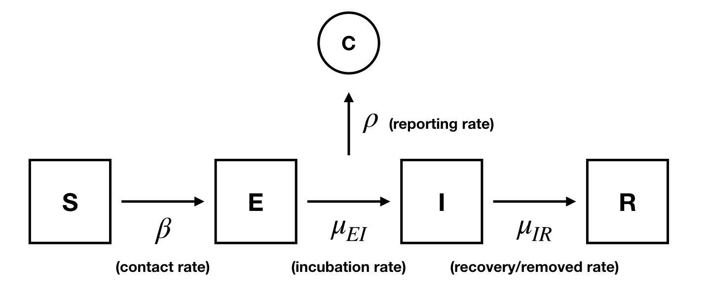
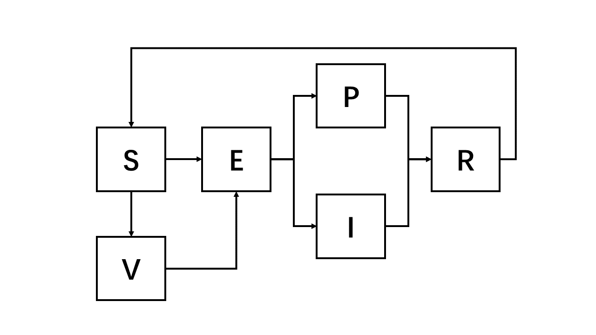

```{r message=FALSE, warning=FALSE, include=FALSE}
library(tidyverse)
library(dplyr)
library(ggplot2)
library(pomp)
library(knitr)
library(forecast)
```

```{r,include=FALSE}
full_data = read.csv("time_series_covid19_confirmed_US.csv")
str(full_data)

sea_data = full_data %>% filter(Admin2 == "King", Province_State == "Washington")
sea_data <- as.data.frame(t(sea_data[, 12:ncol(sea_data)]))
colnames(sea_data) <- c("Cases")
selected_observations <- sea_data$Cases[seq(from = 1, to = nrow(sea_data), by = 7)]
differences <- diff(selected_observations)
sea_df <- data.frame(week = seq(from = 1, to = length(differences), by = 1), cases = differences)
write.csv(sea_df, file = "seattle_covid.csv", row.names = FALSE)
```

# Introduction

On December 31, 2019, the World Health Organization (WHO) was informed of an outbreak of “pneumonia of unknown cause” detected in Wuhan City, Hubei Province, China – the seventh-largest city in China with 11 million residents[@Background].The virus will spread when infected person breathes out droplets and very small particles that contain the virus. It related to the Middle Eastern Respiratory Syndrome virus (MERS-CoV) and the Severe Acute Respiratory Syndrome virus (SARSCoV), namely Coronavirus Disease 2019(COVID-19). 

The first confirmed case relating to the COVID-19 pandemic in the United States was announced by the state of Washington on January 21, 2020. On February 28, Washington made the first announcement of a death from the disease in the U.S. and later announced that two deaths there on February 26 were also due to COVID-19.Washington had 1,989,477 confirmed cases and a total of 16,100 confirmed deaths as of September 6, 2023[@2024/covid-washington]. The first recognized COVID-19 death is in King County. Consequently, King County was selected as the focal point of our investigation. This decision was informed by two primary considerations: firstly, King County holds the distinction of being the location where the initial COVID-19 related fatality was recorded; secondly, the prevalence of outbreak cases in King County offers a more substantial dataset for examination, thereby facilitating a more robust analysis. Since the transmission of COVID-19 is a partially observed Markov process including different states[@9671543]. Our research conduct ARMA model and POMP model to analyze the infection pattern of COVID-19 and predict the number of infections in the future.The main target is to understanding the transmission dynamics of COVID-19 and give suggestions to government on making public policies.

# Exploratory Data Analysis

The data is collected from John Hopkins University the Center for Systems Science and Engineering (CSSE)[@dataresource]. Based on the daily infected cases data, we have turned it into weekly data and then differentiated since the data is cumulative. This is also done for simplicity, the raw data is on the daily bases so it would be very time consuming to simulate a large amount of data in our POMP model.

The figure 1 reveals a timeline of cases of COVID-19 in King County, Washington, reported on a weekly basis from January 2020 to March 2023. We can observe a clear representation of the initial outbreak, subsequent waves, and the eventual decline in cases. The most notable peak occurs sharply around the midpoint of the timeline, significantly higher than the surrounding data points. This particularly prominent spike around the 100th week likely represents a severe outbreak or the emergence of a more infectious variant.

```{r,warning=FALSE,fig.cap=fig1,fig.align="center"}
fig1 =
  "**Figure 1.** *Cases of COVID-19 in King County from January 2020 to March 2023 *"
data = sea_df
data %>% ggplot(aes(x = week, y = cases)) + geom_line()   +
  theme_bw() + labs(x = "Weeks", y = "Cases")
head(sea_df[,1:2],10)
```

To check whether the data is stationary, we draw the ACF and PACF plots below. As shown in the figure 2, there is a sharp drop-off after lag 1 then hovers around zero but within the confidence interval.This indicates that the weekly differentiation has removed most of the autocorrelation in the data. The time series appears to be stationary after differencing, which is typically done to remove trends and seasonal effects to stabilize the mean of the time series.

```{r echo=FALSE,fig.cap=fig2,fig.align="center"}
fig2 ="**Figure 2.** *ACF plot of COVID-19 cases in King County,Washington*"
acf(sea_df$cases, lag.max=50, main = "Autocorrelation of Weekly Infected Cases")
```

The PACF has a significant spike at lag 1 and then rapidly falls within the confidence interval in subsequent lags.There are no other significant spikes outside the confidence interval, which suggests that there is no significant partial autocorrelation at higher lags.

```{r echo=FALSE,fig.cap=fig3,fig.align="center"}
fig3 ="**Figure 3.** *PACF plot of COVID-19 cases in King County,Washington*"
pacf(sea_df$cases, lag.max=50, main = "Partial Autocorrelation of Weekly Infected Cases")
```

# ARMA Model

The Automatic Regressive Integrated Moving Average (ARIMA) model has been successfully applied in the field of health as well as in different fields in the past due to its simple structure, fast applicability and ability to explain the data set[@CAO2020135491]. According to Ceylan, ARIMA models have been successfully applied in the past to estimate the incidence and prevalence of influenza mortality, malaria incidence,hepatitis, and other infectious diseases[@CEYLAN2020138817]. Many researchers has conduct ARIMA model to predict COVID- 19 incidence, prevalence, and mortality rate in the recent years.

For the raw data we use, doing the difference operation will make it look more stationary and therefore more appropriate for ARMA modeling. $$z_n = \Delta y_n^* = y_n^* - y_{n-1}^*$$ Formally,the ARIMA(p,d,q) model with intercept ${\mu}$ for ${Y_{1:N}}$ is[@2024/lec06]: $$\phi(B)\left[(1 - B)dY_n - \mu\right] = \psi(B) \varepsilon_n$$ where $\{\varepsilon_n\}$ is a white noise process; $\phi(x)$ and $\psi(x)$ are ARMA polynomials.[@2024/lec05] $$\mu = \mathbb{E}[Y_n]$$ $$\phi(x) = 1 - \phi_1 x - \cdots - \phi_p x^p$$ $$\psi(x) = 1 + \psi_1 x + \cdots + \psi_q x^q$$ $$\varepsilon_n \sim \text{iid } \mathcal{N}(0, \sigma^2)$$

## Model Selection

The following table shows the AIC values for a range of different choices of p and q in our ARIMA model. From the table, we select $p=3$ and $q=3$ since it has the lowest AIC value of 2925.627. Therefore, we choose to proceed with ARIMA(3,1,3) model.

```{r,warning=F}
# code from [@2024/lec05], page 9-10
aic_table <- function(data,P,Q){
  table <- matrix(NA,(P+1),(Q+1))
  for(p in 0:P) {
    for(q in 0:Q) {
      table[p+1,q+1] <- arima(data,order=c(p,1,q), method = "ML")$aic
    }
  }
  dimnames(table) <- list(paste("AR",0:P, sep=""),paste("MA",0:Q,sep=""))
  table
}
king_aic_table <- aic_table(sea_df$cases,5,5)
knitr::kable(king_aic_table,digits=3, caption = 'Table 1: AIC Table for ARIMA Model')
```

The coefficient is calculated as below, we can write the ARIMA(3,1,3) model as: 
$$
(1 - 1.4254B + 0.9410B^2 - 0.3236B^3)\nabla X_t = \\
(1 - 1.4029B + 1.410B^2 - 0.9879B^3)\varepsilon_t
$$
where B represents the backshift operator.

```{r}
arima_covid <- arima(sea_df$cases, order=c(3,1,3))
arima_covid
```

## Residual Analysis

The following plot shows the residuals over time from ARIMA(3,1,3) model. The smoothed line is almost flat and the residuals fluctuate around a constant mean except a pronounced spike observed around the 100-week. This suggesting that the differencing and the ARIMA model have adequately captured the trend in the data. We can observe certain stationarity and good fit for this model. However, the presence of a significant spike indicate the model may not catch the outlier of the data and sudden large scale outbreak of the pandemic.

```{r,fig.cap=fig4,fig.align="center"}
fig4="**Figure 4.** *Residuals Time Plot of ARIMA(3,1,3) Model*"
resids = residuals(arima_covid)
plot(resids, type='l', ylab='Residuals')
loess_fit <- loess(resids ~ time(resids))
smoothed_resids <- predict(loess_fit)
lines(smoothed_resids, col = "red", lwd = 2)
```
The following figure 5 and figure 6 shows the ACF and the QQ-plot for the ARIMA(3,1,3) residuals. The ACF values fall within the confidence bounds for all lags. This indicates that the residuals are not autocorrelated, signal that the model has captured the time series' underlying structure adequately. The ACF hovering around zero indicate that the residuals are behaving like white noise.

```{r,fig.cap=fig5,fig.align="center"}
fig5="**Figure 5.** *ACF Plot of ARIMA(3,1,3) Residuals*"
acf(resids)
```

From the QQ-plot, the points generally follow a straight line except for the ends, which deviate significantly. The deviation suggest that the distribution of residuals has heavier tails than the normal distribution, which could be an indication of outliers and may not satisfy the normaility assumption. This is consistent with the results we obtained earlier in the residual time plot part.

```{r,fig.cap=fig6,fig.align="center"}
fig6="**Figure 6.** *QQ Plot of ARIMA(3,1,3) Residuals*"
qqnorm(resids)
```

# SEIR Model

```{r setup, include=FALSE, echo = FALSE}
knitr::opts_chunk$set(echo = TRUE)
library(tidyverse)
library(pomp)
library(tidyverse)
library(magick)
library(doParallel)
library(doRNG)

cores <-  as.numeric(Sys.getenv('SLURM_NTASKS_PER_NODE', unset=NA))
if(is.na(cores)) cores <- detectCores()  
print(cores)
# cl <- makeCluster(cores)
registerDoParallel(cores)  # change this number locally, you don't have 36 cores.
registerDoRNG(531)
if (.Platform$OS.type=="windows") 
  options(pomp_cdir="./tmp")
```

## Model Introduction

We propose experimenting with the SEIR model as outlined in Chapter 12 of the lecture notes [@lec_note_chap12]. The SEIR model includes one observed stage and four latent stages, depicted in the following flowchart [@2021_531_FP_SEIR]:


The observed stage represents the reported cases, denoted as $c$, and the latent stages are Susceptible (S), Exposed (E), Infected (I), and Recovered (R). 

The first confirmed case was observed on January 20; however, the patient had returned to the United States on January 15 [@sea_covid_news]. Considering that our dataset begins on January 22, 2020—seven days after the patient's return—it is reasonable to assume the presence of at least 5 infected and 20 exposed individuals by this date.

Furthermore, we will adopt the following assumptions for the SEIR model:

* The transition rates $\beta, \mu_{EI}, \mu_{IR}, \rho$ are constant over time and are unaffected by interventions such as vaccination, masking, the establishment of reporting systems, or lockdown policies.
* Individuals who have recovered from COVID-19 are assumed to have perfect immunity, meaning they cannot be reinfected.
* The population of King County is estimated at 2,267,000, with the majority ($\eta=0.99$) being susceptible to COVID-19.

## Initial Investigation
With the above assumptions, after experimenting with different values, we propose that the parameters $\beta=1.2,\mu_{EI} = 0.4,\mu_{IR}=0.93,\rho=0.3, k=100, \eta=0.99,N=2267000$ provide a reasonable fit for our model according to the simulation results shown below.

```{r, echo = FALSE}
full_data = read.csv("time_series_covid19_confirmed_US.csv")
# str(full_data)
sea_data = full_data %>% filter(Admin2 == "Washtenaw", Province_State == "Michigan")
sea_data <- as.data.frame(t(sea_data[, 12:ncol(sea_data)]))
colnames(sea_data) <- c("Cases")
selected_observations <- sea_data$Cases[seq(from = 1, to = nrow(sea_data), by = 7)]
differences <- diff(selected_observations)
sea_df <- data.frame(week = seq(from = 1, to = length(differences), by = 1), cases = differences)
write.csv(sea_df, file = "seattle_covid.csv", row.names = FALSE)
data = read_csv(file = "seattle_covid.csv", show_col_types = FALSE)
```

```{r, echo = TRUE, warning=FALSE}
set.seed(531)
data |>
  select(week,reports=cases) -> meas

sir_step <- Csnippet("
  double dN_SE = rbinom(S,1-exp(-Beta*I/N*dt));
  double dN_EI = rbinom(E,1-exp(-mu_EI*dt));
  double dN_IR = rbinom(I,1-exp(-mu_IR*dt));
  S -= dN_SE;
  E += dN_SE - dN_EI;
  I += dN_EI - dN_IR;
  R += dN_IR;
  H += dN_IR;
")

sir_rinit <- Csnippet("
  S = nearbyint(eta*N);
  E = 20;
  I = 5;
  R = nearbyint((1-eta)*N);
  H = 0;
")
# nearbyint((1-eta)*N)

sir_dmeas <- Csnippet("
  lik = dnbinom_mu(reports,k,rho*H,give_log);
")

sir_rmeas <- Csnippet("
  reports = rnbinom_mu(k,rho*H);
")

meas |>
  pomp(times="week",t0=0,
    rprocess=euler(sir_step,delta.t=1/7),
    rinit=sir_rinit,
    rmeasure=sir_rmeas,
    dmeasure=sir_dmeas,
    accumvars="H",
    statenames=c("S","E","I","R","H"),
    paramnames=c("Beta","mu_EI","mu_IR","N","eta","rho","k"),
    params=c(Beta=1.2,mu_EI = 0.4,mu_IR=0.93,rho=0.3, k=100,
            eta=0.99,N=2267000),
    partrans=parameter_trans(log=c("Beta","mu_EI","mu_IR","k"),logit=c("rho","eta"))
    # show_col_types = FALSE
  ) -> measSEIR
```


```{r, echo = FALSE}
set.seed((531))
measSEIR |>
  simulate(
    params=c(Beta=1.2,mu_EI = 0.4,mu_IR=0.93,rho=0.3, k=100,
            eta=0.99,N=2267000),
    nsim=30,format="data.frame",include.data=TRUE
    # show_col_types = FALSE
  ) -> sims

sims |>
  ggplot(aes(x=week,y=reports,group=.id,color=.id=="data"))+
  geom_line()+
  guides(color="none")
```

## Local Search

Starting with the parameters mentioned above, we initiated a local search for maximizing the log likelihood.

```{r, echo = FALSE}
set.seed((531))
st <- Sys.time()
bake(file="local_search.rds",{
  foreach(
    i=1:10,.combine=c,.packages=c("pomp")
    ) %dopar% {
      library(pomp)
      library(tidyverse)
      measSEIR |>
        mif2(
          Np=1000, Nmif=50,
          cooling.fraction.50=0.5,
          # params=c(Beta=1.7,mu_EI = 0.23,mu_IR=0.93,rho=0.5,k=7,
          #   eta=0.9999,N=2267000),
          params=c(Beta=1.2,mu_EI = 0.4,mu_IR=0.93,rho=0.3, k=100,
            eta=0.99,N=2267000),
          rw.sd=rw_sd(Beta=0.01, mu_EI=0.01,rho=0.01, eta=ivp(0.01), mu_IR=0.01, k = 0.01),
        ) 
    } -> mifs_local
  attr(mifs_local,"ncpu") <- getDoParWorkers()
  mifs_local
}) -> mifs_local
t_loc <- attr(mifs_local,"system.time")
ncpu_loc <- attr(mifs_local,"ncpu")
et <- Sys.time()
rt_local = difftime(et,st,units="secs")
# 2 min
```


```{r, echo = FALSE}
mifs_local |>
traces() |>
melt() |>
ggplot(aes(x=iteration,y=value,group=.L1,color=factor(.L1)))+
geom_line()+
guides(color="none")+
facet_wrap(~name,scales="free_y")
```

The optimization process appears to have been successful, as evidenced by the convergence of the log likelihood plot around the value of -1200. While the other parameters did not converge to a consistent value, their final values at the end of most of the random walk iterations do not significantly differ from each other. This observation may suggest a potential issue of weak identifiability, implying that the parameters could assume a range of plausible values. The highest log likelihood achieved was -1195.915, with the corresponding optimal parameters presented in the table below:

```{r, echo = TRUE}
set.seed((531))
bake(file="local_logliks.rds",{
  foreach(mf=mifs_local,.combine=rbind
  ) %dopar% {
    library(pomp)
    library(tidyverse)
    evals <- replicate(10, logLik(pfilter(mf,Np=2000)))
    ll <- logmeanexp(evals,se=TRUE)
    mf |> coef() |> bind_rows() |>
      bind_cols(loglik=ll[1],loglik.se=ll[2])
    # ,Np=1002,nfilt=10
  }
}) -> local_logliks
```


```{r, echo = FALSE}
max_row <- local_logliks %>%
  slice(which.max(loglik));max_row
pairs(~loglik+Beta+eta+rho+mu_EI+mu_IR+k,data=local_logliks,pch=16)
```

With the set of parameter that has maximized log likelihood, we can run simulations to visually evaluate the goodness of fit to the data. By the simulation plot below, the local search resulting parameters perform poorly as non of the simulations accurately capture the long-term trends observed in the data. 

```{r, echo = FALSE}
set.seed((531))
measSEIR |>
  simulate(
    params=c(Beta=1.802128,mu_EI = 1.276891,mu_IR=1.983209,rho=0.5232388,k=1.402858,
      eta=0.9899417,N=2267000),
    nsim=15,format="data.frame",include.data=TRUE
    # show_col_types = FALSE
  ) -> sims

sims |>
  ggplot(aes(x=week,y=reports,group=.id,color=.id=="data"))+
  geom_line()+
  guides(color="none")
```


## Global search
Given the suboptimal performance of the local search results, we suspect that the starting point might be the issue, so we conducted a global search with 100 randomly sampled initial parameter sets.

```{r, echo = TRUE}
set.seed((531))
fixed_params <- coef(measSEIR,c("N"))
freeze(
  runif_design(
    lower=c(Beta=0.1,rho=0.5,eta=0.98,mu_EI=0.1,mu_IR=0.1, k = 0.1),
    upper=c(Beta=1000,rho=0.97,eta=1,mu_EI=10,mu_IR=10, k = 10),
    nseq=100
  ),
)-> guesses
set.seed((531))
st <- Sys.time()
bake(file="seir_global.rds",{
  foreach(guess=iter(guesses,"row"), .combine=rbind
  ) %dopar% {
    library(pomp)
    library(tidyverse)
    measSEIR |>
      mif2(
        Nmif=50, Np=200,
        cooling.fraction.50=0.5,
        rw.sd=rw_sd(Beta=0.02, mu_EI=0.02,rho=0.02, eta=ivp(0.01), mu_IR=0.02, k = ivp(0.02)),
        params=c(unlist(guess),fixed_params)
      ) |>
      mif2(Nmif=50,
           rw.sd=rw_sd(Beta=0.01, mu_EI=0.01,rho=0.01, eta=ivp(0.01), mu_IR=0.01, k = ivp(0.01))) -> mf
   evals <- replicate(10, logLik(pfilter(mf,Np=1000)))
   ll <- logmeanexp(evals,se=TRUE)
    mf |> coef() |> bind_rows() |>
      bind_cols(loglik=ll[1],loglik.se=ll[2])
  } -> global
  attr(global,"ncpu") <- getDoParWorkers()
  global
}) -> global
t_loc <- attr(global,"system.time")
ncpu_loc <- attr(global,"ncpu")
et <- Sys.time()
rt_global = difftime(et,st,units="secs")
# 5 min
```


```{r, echo = FALSE}
max_row <- global %>%
  slice(which.max(loglik));max_row
pairs(~loglik+Beta+eta+rho+mu_EI+mu_IR+k,data=global,pch=16)
```

The global search yielded a better log likelihood of -1194.489, surpassing the local search's -1195.194. Further simulations demonstrated that while the global search parameters slightly improved the modeling of low magnitude variations, they failed to capture the significant peak at week 100. Therefore, SEIR model with the above assumptions could not fully explain the data, so we have to relax some assumptions to modify the model for improvement. 

```{r, echo = FALSE}
set.seed((531))
measSEIR |>
  simulate(
    params=c(Beta=6.476012,mu_EI = 2.053022,mu_IR=15.65054,rho=0.8722287,k=2.979094,
      eta=0.9881086,N=2267000),
    nsim=15,format="data.frame",include.data=TRUE
    # show_col_types = FALSE
  ) -> sims

sims |>
  ggplot(aes(x=week,y=reports,group=.id,color=.id=="data"))+
  geom_line()+
  guides(color="none")
```


```{r prepare, echo=FALSE, warning=FALSE, message=FALSE}
rm(list = ls())

# from Edward L. Ionides STATS531 Lecture 14's R model script 
# (https://kingaa.github.io/sbied/pfilter/model.R)
library(tidyverse)
library(pomp)

library(foreach)
library(doParallel)
library(doRNG)
library(iterators)

registerDoParallel(detectCores())
registerDoRNG(123)

run_level <- 3

result_dir <- file.path(".", paste0("SVEIPR_results_run_level_", run_level)) 
if (!dir.exists(result_dir)) dir.create(result_dir)

param_file <- "pomp_model_params.csv"

clear_rds <- FALSE
if (clear_rds) {
  delfiles <- dir(path = result_dir, pattern = "*.rds")
  if (file.exists(file.path(result_dir, delfiles))) {
     file.remove(file.path(result_dir, delfiles))
  } 
}
```


```{r, echo=FALSE}
full_data <- read.csv("time_series_covid19_confirmed_US.csv")

sea_data <- full_data |> filter(Admin2 == "King", Province_State == "Washington")
sea_data <- as.data.frame(t(sea_data[, 12:ncol(sea_data)]))
colnames(sea_data) <- c("reports")
selected_observations <- sea_data$reports[seq(from = 1, to = nrow(sea_data), by = 7)]
differences <- diff(selected_observations)
sea_df <- data.frame(week = seq(from = 1, to = length(differences), by = 1), reports = differences)
```

```{r, echo=FALSE}
# sea_df |> ggplot(aes(x = week, y = reports)) +
#               geom_line()
```

# SVEIPR Model

## Model Construction and Model Assumption

We learn from the previous SEIR fit and adjust our model assumption to achieve more reasonable simulation. When we review the assumptions in SEIR model, we can find that most of them can only be satisfied in some customized experimental environments, which greatly degrades its performance on real-life data. For instance, it assumes that the $\beta$ and $\mu_{EI}$ are constants, but actually these variables are highly likely to be influenced by the new variants of virus, vaccination, and quarantine policy. Therefore, we should not treat them as constants, especially when our data span covers about three years. Besides, it also doesn't consider the cases where recovered people may be reinfected, which is very common according to the report [@2024/covid_reinfection]. Due to these reasons, we revise our model assumption and propose a new model SVEIPR. (Note: We build this model according to [@2022/final_project_04]'s SEPIR and [@2022/final_project_05]'s SVEIQRD. We would like to give full credits to them. The main innovation in this SVEIPR model is the adjustable "S" to "V" transformation rate.). Compared with SEIR, our SVEIPR model adds stages "P" (potentially infected) and "V" (vaccine), includes a reinfection link (i.e., the link from stage "R" to "S"), and automatically adjusts $\beta, \mu_{SV}$ in different periods. The detailed model structure is displayed below:




Similar to [@2022/final_project_05], we showcase the transition between compartment:

$$
\begin{aligned}
\Delta N_{SV}(t) &\sim Binomial(S, 1 - \exp\{ -\mu_{SV}^{(t)} ((I + P) / N) \Delta t\}) \\
\Delta N_{SE}(t) &\sim Binomial(S, 1 - \exp\{-\beta^{(t)} ((I + P) / N) \Delta t\}) \\
\Delta N_{VE}(t) &\sim Binomial(V, 1 - \exp\{-(1 - \gamma) \beta^{(t)} ((I + P) / N) \Delta t\}) \\
\Delta N_{EPI}(t) &\sim Binomial(E, 1 - \exp\{-\mu_{EPI} \Delta t\}) \\
\Delta N_{PR}(t) &\sim Binomial(P, 1 - \exp\{-\mu_{PR} \Delta t\}) \\
\Delta N_{IR}(t) &\sim Binomial(I, 1 - \exp\{-\mu_{IR} \Delta t\}) \\
\Delta N_{RS}(t) &\sim Binomial(R, 1 - \exp\{-\mu_{RS} \Delta t\})
\end{aligned}
$$
, where $\mu_{SV}^{(t)}$ and $\beta^{(t)}$ will change according to time periods; $\gamma$ is the vaccine effectiveness; $\Delta N_{EPI}(t)$ will be divided into $\Delta N_{EP}(t)$ and $\Delta N_{EI}(t)$, which follows $\Delta N_{EPI}(t) = \alpha \Delta N_{EP}(t) + (1 - \alpha) \Delta N_{EI}(t)$; please notice that we multiply $\mu_{SV}^{(t)}$ by $((I + P) / N)$, because we think that people are more willing to get vaccinated to protect themselves in the event of an outbreak.


We divide the data time span into 9 periods: [1, 18], (18, 33], (33, 49] (49, 60], (60, 75], (75, 97], (97, 112], (112, 150], (150, 163]. For each period, we define different $\mu_{SV}^{(t)}$ and $\beta^{(t)}$ values. Specially, there are no vaccine before week 54, according to data [@2024/vaccine_data]. (In our implementation, we use $\beta^{(t))} = b_{i(t)} \times \beta$ and $\mu_{SV}^{(t)} = c_{i(t)} \times \mu_{SV}$ to realize the adjustment).


As for parameters initialization, we inherit most initial parameter from previous SEIR model but make slight modification to get a better initial simulation outcome. We set our initial parameters to $\beta = 1.01$, $\mu_{SV} = 0.5$, $\mu_{EPI} = 1.3$, $\mu_{PR} = 0.93$, $\mu_{IR} = 0.98$, $\mu_{RS} = 0.5$, $\alpha = 0.4$, $\rho = 0.3$, $\eta = 0.95$, $N = 2269675$, $\tau = 0.25$, $\gamma = 0.8$.


```{r}
intervention_indicator <- rep(0, length(sea_df$week))

for (i in seq_along(sea_df$week)) {
  if (i <= 18) {
    intervention_indicator[i] <- 1
  } else if (i > 18 && i <= 33) {
    intervention_indicator[i] <- 2
  } else if (i > 33 && i <= 49) {
    intervention_indicator[i] <- 3
  } else if (i > 49 && i <= 60) {
    intervention_indicator[i] <- 4
  } else if (i > 60 && i <= 75) {
    intervention_indicator[i] <- 5
  } else if (i > 75 && i <= 97) {
    intervention_indicator[i] <- 6
  } else if (i > 97 && i <= 112) {
    intervention_indicator[i] <- 7
  } else if (i > 112 && i <= 150) {
    intervention_indicator[i] <- 8
  } else {
    intervention_indicator[i] <- 9
  }
}

vaccine_indicator <- rep(0, length(sea_df$week))

for (i in seq_along(sea_df$week)) {
  if (i <= 54) {
    vaccine_indicator[i] <- 1
  } else if (i > 54 && i <= 60) {
    vaccine_indicator[i] <- 2
  } else if (i > 60 && i <= 75) {
    vaccine_indicator[i] <- 3
  } else if (i > 75 && i <= 97) {
    vaccine_indicator[i] <- 4
  } else if (i > 97 && i <= 112) {
    vaccine_indicator[i] <- 5
  } else if (i > 112 && i <= 150) {
    vaccine_indicator[i] <- 6
  } else {
    vaccine_indicator[i] <- 7
  }
}

covar_ <- covariate_table(
  week = sea_df$week,
  intervention = intervention_indicator,
  vaccine = vaccine_indicator,
  times = "week"
)

sepir_step <- Csnippet("
  double beta_intervention;
  
  if (intervention == 1){
    beta_intervention = Beta * b1;
  } else if (intervention == 2) {
    beta_intervention = Beta * b2;
  } else if (intervention == 3) {
    beta_intervention = Beta * b3;
  } else if (intervention == 4){
    beta_intervention = Beta * b4;
  } else if (intervention == 5) {
    beta_intervention = Beta * b5;
  } else if (intervention == 6) {
    beta_intervention = Beta * b6;
  } else if (intervention == 7) {
    beta_intervention = Beta * b7;
  } else if (intervention == 8) {
    beta_intervention = Beta * b8;
  } else {
    beta_intervention = Beta;
  }
  
  double mu_SV_intervention;
  
  if (vaccine == 1) {
    mu_SV_intervention = 0;
  } else if (vaccine == 2) {
    mu_SV_intervention = mu_SV * c1;
  } else if (vaccine == 3) {
    mu_SV_intervention = mu_SV * c2;
  } else if (vaccine == 4) {
    mu_SV_intervention = mu_SV * c3;
  } else if (vaccine == 5) {
    mu_SV_intervention = mu_SV * c4;
  } else if (vaccine == 6) {
    mu_SV_intervention = mu_SV * c5;
  } else {
    mu_SV_intervention = mu_SV;
  }
  
  double dN_SE = rbinom(S, 1 - exp(-beta_intervention * (I + P) / N * dt));
  
  double dN_SV = 0;
  double dN_VE = 0;
  
  if (vaccine != 1) {
    dN_SV = rbinom(S, 1 - exp(-mu_SV_intervention * (I + P) / N * dt));
    dN_VE = rbinom(V, 1 - exp(-(1 - gamma) * beta_intervention * (I + P) / N * dt));
  }
  
  double dN_EPI = rbinom(E, 1 - exp(-mu_EPI * dt));
  double dN_PR = rbinom(P, 1 - exp(-mu_PR * dt));
  double dN_IR = rbinom(I, 1 - exp(-mu_IR * dt));
  double dN_RS = rbinom(I, 1 - exp(-mu_RS * dt));
  if (vaccine == 1) {
    S -= dN_SE - dN_RS;
    E += dN_SE - dN_EPI;
    P += nearbyint(alpha * dN_EPI) - dN_PR;
    I += nearbyint((1 - alpha) * dN_EPI) - dN_IR;
    R += dN_PR + dN_IR;
    H += dN_IR;
  } else {
    S -= dN_SE - dN_RS + dN_SV;
    V += dN_SV - dN_VE;
    E += dN_SE - dN_EPI + dN_VE;
    P += nearbyint(alpha * dN_EPI) - dN_PR;
    I += nearbyint((1 - alpha) * dN_EPI) - dN_IR;
    R += dN_PR + dN_IR;
    H += dN_IR;
  }
  
  if (S < 0) {
    S = 0;
  } 
  
  if (V < 0) {
    V = 0;
  }
  
  if (P < 0) {
    P = 0;
  }
  
  if (I < 0) {
    I = 0;
  }
  
  if (R < 0) {
    R = 0;
  }
  
  if (H < 0) {
    H = 0;
  }
  
")

sepir_init <- Csnippet("
  S = nearbyint(eta * N);
  V = 0;
  E = 1000;
  I = 500;
  P = 500;
  R = nearbyint((1 - eta) * N);
  H = 0;
")

dmeas <- Csnippet("
  double tol = 1.0e-25;
  double mean = rho * H;
  double sd = sqrt(pow(tau * H, 2) + rho * H);
  if (reports > 0.0) {
    lik = pnorm(reports + 0.5, mean, sd, 1, 0) - 
          pnorm(reports - 0.5, mean, sd, 1, 0) + tol;
  } else {
    lik = pnorm(reports + 0.5, mean, sd, 1, 0) + tol;
  }
  if (give_log) lik = log(lik);
")

rmeas <- Csnippet("
  reports = rnorm(rho * H, sqrt(pow(tau * H, 2) + rho * H));
  if (reports > 0.0) {
    reports = nearbyint(reports);
  } else {
    reports = 0.0;
  }
")
```

```{r, echo=FALSE}
sea_df |>
  pomp(
    times = "week", t0 = 1,
    rprocess = euler(sepir_step, delta.t = 1),
    rinit = sepir_init,
    rmeasure = rmeas,
    dmeasure = dmeas,
    accumvars = "H",
    partrans = parameter_trans(
      log = c("Beta", "b1", "b2", "b3", "b4", "b5", "b6", "b7", "b8",
              "c1", "c2", "c3", "c4", "c5",
              "mu_SV",
              "mu_EPI", "mu_PR", "mu_IR", "mu_RS", "tau"),
      logit = c("rho", "alpha", "eta", "gamma")
    ),
    covar = covar_,
    statenames = c("S", "V", "E", "P", "I", "R", "H"),
    paramnames = c("Beta", 
                   "b1", "b2", "b3", "b4", "b5", "b6", "b7", "b8",
                   "c1", "c2", "c3", "c4", "c5",
                   "mu_SV",
                   "mu_EPI", "mu_PR", "mu_IR", "mu_RS", 
                   "eta", "rho", "N", "tau", "alpha", "gamma"),
    params = c(Beta = 1.01, 
               b1 = 0.5, b2 = 0.6, b3 = 0.8, b4 = 0.9, b5 = 0.9, b6 = 1.2, b7 = 2.0, b8 = 2.2, 
               c1 = 0.9, c2 = 1.2, c3 = 2.0, c4 = 2.0, c5 = 1.2,
               mu_SV = 0.5,
               mu_EPI = 1.3, mu_PR = 0.93, mu_IR = 0.98, mu_RS = 0.5,
               alpha = 0.4, rho = 0.3, eta = 0.95, N = 2269675, tau = 0.25, gamma = 0.8),
    cdir = ".", cfile = "pomp_compiled"
  ) -> pomp_model
```


We display the initial simulation of our model with the guess parameters, and analyze the simulation result. As shown in the following plot, the initial simulation our SVEIPR model roughly matches the original data and the effective sample size (ESS) are greater than 0 over most regions. The loglik of this model is -5239.32 with standard error 80.546. This is a frustrating result, but it can be improved through local search and global search. One noticeable thing is that our model fails to find the local peak and the ESS around these local peaks approaches 0. To get a better fit, we conduct local search.


```{r, echo=FALSE}
set.seed(1)
pomp_model |>
  simulate(nsim = 20, format = "data.frame", include.data = TRUE) |>
  ggplot(aes(x = week, y = reports, group = .id, color= .id == "data"))+
  geom_line()+
  guides(color = "none")
```

```{r, echo=FALSE}
pomp_model |>
  pfilter(Np = 1000) -> pf
plot(pf)
```

```{r, echo=FALSE}
foreach(i = 1:10, .combine = c,
  .packages = c("pomp")
) %dopar% {
  pomp_model |> pfilter(Np = 1000)
} -> init_pf

init_pf |> logLik() |> logmeanexp(se = TRUE) -> init_l_pf

init_pf[[1]] |> coef() |> bind_rows() |>
  bind_cols(loglik = init_l_pf[1], loglik.se = init_l_pf[2]) |> 
  write_csv(file.path(result_dir, param_file))
```

## Local Search

```{r}
bake(file = file.path(result_dir, 
                      paste0("local_search_run_level_", run_level, ".rds")), {
  foreach(i = 1:10, .combine = c,
    .packages = c("pomp")
  ) %dopar% {
    pomp_model |>
      mif2(
        Np = 2000, Nmif = 200,
        cooling.fraction.50 = 0.5,
        rw.sd = rw_sd(b1 = 0.02, b2 = 0.02, b3 = 0.02, b4 = 0.02, b5 = 0.02, b6 = 0.02, b7 = 0.02, b8 = 0.02,
                      c1 = 0.02, c2 = 0.02, c3 = 0.02, c4 = 0.02, c5 = 0.02,
                      mu_EPI = 0.02,
                      rho = 0.02, tau = 0.002, eta = ivp(0.02), gamma = ivp(0.02))
      )
  } -> mifs_local
  attr(mifs_local, "ncpu") <- getDoParWorkers()
  mifs_local
}) -> mifs_local

t_loc <- attr(mifs_local, "system.time")
ncpu_loc <- attr(mifs_local, "ncpu")
```

The results of our local search are reported below, and we can get some observations from it: (1) The local search successfully converges to the local maximum log likelihood. As shown in the loglik plot, most of the models can reach the maximum loglik after about 60 iterations. The best local search result is loglik = -1397 with loglok.se = 0.0077. (2) The output $b_i$ values follows the trend of infected cases. For $b_7$ and $b_8$, we can observe significant peaks in their corresponding time periods. (3) The final values of $\eta$ and $\gamma$ are distributed in a narrow range ($\eta \in (0.945, 0.960)$ and $\gamma \in (0.76, 0.82)$), which indicates that most people are susceptible and the vaccine effectiveness is relatively high.


```{r, echo=FALSE}
# from Edward L. Ionides STATS531 Lecture 14 slide page 34
mifs_local |>
  traces() |>
  melt() |>
  ggplot(aes(x = iteration, y = value, group = .L1, color = factor(.L1))) +
  geom_line() +
  guides(color = "none") +
  facet_wrap(~name, scales = "free_y")
```


```{r, echo=FALSE}
# from Edward L. Ionides STATS531 Lecture 14 slide page 38
bake(file = file.path(result_dir, 
                      paste0("lik_local_run_level_", run_level, ".rds")), {
  foreach(mf = mifs_local, .combine = rbind,
    .packages = c("pomp", "tidyverse")
  ) %dopar% {
    evals <- replicate(10, logLik(pfilter(mf, Np = 5000)))
    ll <- logmeanexp(evals, se = TRUE)
    mf |> coef() |> bind_rows() |>
      bind_cols(loglik = ll[1], loglik.se = ll[2])
  } -> results
  attr(results, "ncpu") <- getDoParWorkers()
  results
}) -> local_results

```

We use the best parameters found by the local search to conduct simulation and get the following result. As can be seen in the plot, our model can detect the peaks, but there are delay between the true peaks and our simulated peaks. We blame this on the hand-tuned division of the time span. The wrong division may prevent model from finding the best fit.


```{r, echo=FALSE}
set.seed(1)

pomp_model |>
  simulate(
    params=unlist(arrange(local_results, -loglik)[1, ]),
    nsim = 5, format = "data.frame", include.data = TRUE
  )-> local_sims

local_sims |>
  ggplot(aes(x = week, y = reports, group = .id, color= .id == "data")) +
  geom_line() +
  guides(color = "none")
```

We report the likelihood surface of the parameters and get two findings: (1) It's hard to detect the ridges in the likelihood surface, because most points are sparsely distributed in the plot. But for pairs $(b_3, b_5)$ and $(\rho, \tau)$, we find they are correlated, suggesting the existence of ridges. (2) The loglik plot doesn't show a flat plane, and we may increase the loglik by keeping searching.


```{r, echo=FALSE}
pairs(~loglik + b1 + b2 + b3 + b4 + b5 + b6 + b7 + b8,
      data = local_results, pch = 16)
```

```{r, echo=FALSE}
pairs(~loglik + c1 + c2 + c3 + c4 + c5,
      data = local_results, pch = 16)
```

```{r, echo=FALSE}
pairs(~loglik + mu_EPI + eta + gamma + rho + tau,
      data = local_results, pch = 16)
```


```{r, echo=FALSE}
# pairs(~., 
#       data = local_results, pch = 16)

read_csv(file.path(result_dir, param_file), show_col_types = FALSE) |>
  bind_rows(local_results) |>
  arrange(-loglik) |>
  write_csv(file.path(result_dir, param_file))
```

## Global Search

```{r}
set.seed(2062379496)
runif_design(
  lower = c(b1 = 0.5, b2 = 0.2, b3 = 0.5, b4 = 0.1, b5 = 0.3, b6 = 1.0, b7 = 1.0, b8 = 1.0, 
             c1 = 0.5, c2 = 0.3, c3 = 0.3, c4 = 2.0, c5 = 1.0,
             mu_EPI = 0.4,
             rho = 0.3, eta = 0.75, tau = 0.25, gamma = 0.8),
  upper = c(b1 = 6.0, b2 = 1.0, b3 = 2.0, b4 = 1.0, b5 = 1.6, b6 = 5.0, b7 = 15.0, b8 = 15.0, 
            c1 = 5.0, c2 = 5.0, c3 = 5.0, c4 = 20.0, c5 = 20.0,
            mu_EPI = 2.0,
            rho = 1.0, eta = 1.0, tau = 0.5, gamma = 1.0),
  nseq = 100
) -> guesses

fixed_params <- c(Beta = 1.01, mu_PR = 0.93, mu_IR = 0.98, mu_RS = 0.5, alpha = 0.4, 
                  N = 2269675, mu_SV = 0.5)

mf1 <- mifs_local[[1]]

bake(file = file.path(result_dir, 
            paste0("global_search_run_level_", run_level, ".rds")),
     dependson = guesses, 
{
    foreach(guess = iter(guesses, "row"), .combine = c,
      .packages = c("pomp")
    ) %dopar% {
      mf1 |>
        mif2(params = c(guess, fixed_params), 
             Np = 2000, Nmif = 100) |>
        mif2(Nmif = 100) -> mifs_global
      attr(mifs_global, "ncpu") <- getDoParWorkers()
      mifs_global
   }
}) -> mifs_global
```


```{r, echo=FALSE}
bake(file = file.path(result_dir, 
                      paste0("lik_global_run_level_", run_level, ".rds")), {
  foreach(mf = mifs_global, .combine = rbind,
    .packages = c("pomp", "tidyverse")
  ) %dopar% {
    evals <- replicate(10, logLik(pfilter(mf, Np = 5000)))
    ll <- logmeanexp(evals, se = TRUE)
    mf |> coef() |> bind_rows() |>
      bind_cols(loglik = ll[1], loglik.se = ll[2]) |>
      filter(is.finite(loglik))
  } -> results
  attr(results, "ncpu") <- getDoParWorkers()
  results
}) -> global_results
```

In this section, we show and discuss the results of global search. We fist report the log likelihood and its standard error. Compared with local search, we fail to get a significantly better result in global search. The best loglik is about -1377 with loglik.se equal to 0.0056. Even though this beats the local searching by having a lower standard error, the loglik nearly keeps unchanged. 

```{r, echo=FALSE}
# from Edward L. Ionides STATS531 Lecture 14 slide page 34
mifs_global |>
  traces() |>
  melt() |>
  ggplot(aes(x = iteration, y = value, group = .L1, color = factor(.L1))) +
  geom_line() +
  guides(color = "none") +
  facet_wrap(~name, scales = "free_y")
```

By comparing the above plot and the following three pair plots, we get three key observations: (1) Even though some extreme $b_7$ and $b_8$ values appear during the search, they can finally converge to reasonable values. For instance, the best model found in global search has $b_7 = 16.2$ and $b_8 = 18.7$, which are in a reasonable range. For $c$ values, we can also find this phenomenon. (2) The final values of $\gamma, \eta$ match our expectation. If we construct poor man's profile likelihood confidence interval, we can find that $\gamma \in (0.806, 0.988), \eta \in (0.816, 0.979)$. This is consistent with our initial guess that the vaccine is effective and most people are susceptible. (3) The estimation of $\rho$ reject our guess that $\rho$ is around 0.3. The experiments show that the top-5 loglik models have $\rho \in (0.878, 0.960)$, which deviates from our initial expectation a lot.

```{r, echo=FALSE}
pairs(~loglik + b1 + b2 + b3 + b4 + b5 + b6 + b7 + b8,
      data = global_results, pch = 16)
```


```{r, echo=FALSE}
pairs(~loglik + c1 + c2 + c3 + c4 + c5,
      data = global_results, pch = 16)
```


```{r, echo=FALSE}
pairs(~loglik + mu_EPI + eta + gamma + rho + tau,
      data = global_results, pch = 16)
```


The simulation suggests that the model found by global search still can't overcome the drawbacks like delayed peaks. In the future work, we may need to find a new mechanism to automatically recognize the division of time period, rather than hard-coding these divisions by intuition. 

```{r, echo=FALSE}
set.seed(1)

pomp_model |>
  simulate(
    params=unlist(arrange(global_results, -loglik)[1, ]),
    nsim = 5, format = "data.frame", include.data = TRUE
  )-> global_sims

global_sims |>
  ggplot(aes(x = week, y = reports, group = .id, color= .id == "data")) +
  geom_line() +
  guides(color = "none")
```


```{r, echo=FALSE}
read_csv(file.path(result_dir, param_file), show_col_types = FALSE) |>
  bind_rows(global_results) |>
  filter(is.finite(loglik)) |>
  arrange(-loglik) |>
  write_csv(file.path(result_dir, param_file))

read_csv(file.path(result_dir, param_file), show_col_types = FALSE) |>
  filter(loglik > max(loglik) - 50) |>
  bind_rows(guesses) |>
  mutate(type = if_else(is.na(loglik), "guess", "result")) |>
  arrange(type) -> all

# from Edward L. Ionides STATS531 Lecture 14 slide page 48
# pairs(~loglik + Beta + eta + rho + mu_EI, data = all, pch = 16, cex = 0.3,
#       col = ifelse(all$type == "guess", grey(0.5), "red"))
```


# Conclusion

By conducting exploratory data analysis, the trend of weekly cases in King county has obvious initial outbreak, subsequent waves, and the eventual decline. For ARMA modeling, the chosen ARIMA(3,1,3) model, based on the lowest AIC value, captured the pattern of COVID-19 cases with high accuracy, as evidenced by the analysis of the residuals. However, the noticeable peak from the residual plot and deviation at the end of the QQ-plot indicate the model need further test to optimize. The parameter sets optimized through both local and global search methods enabled the SEIR model to explain low magnitude variations in confirmed cases within King County. However, the model was unable to capture significant peaks, highlighting its limitations. To address this problem, we propose SVEIPR model by introducing "V" (vaccine) and "P" (potentially infected) stages while adjusting the $\mu_{SV}^{(t)}$ and $\beta^{(t)}$ according to time period. The fitted model gives a well simulation outcome, and most parameters fall in reasonable ranges. This inspires us that when looking at COVID-19 data we need to jointly consider vaccines, reinfections, asymptomatic infections, and the model parameters may also change over time.


# Reference


