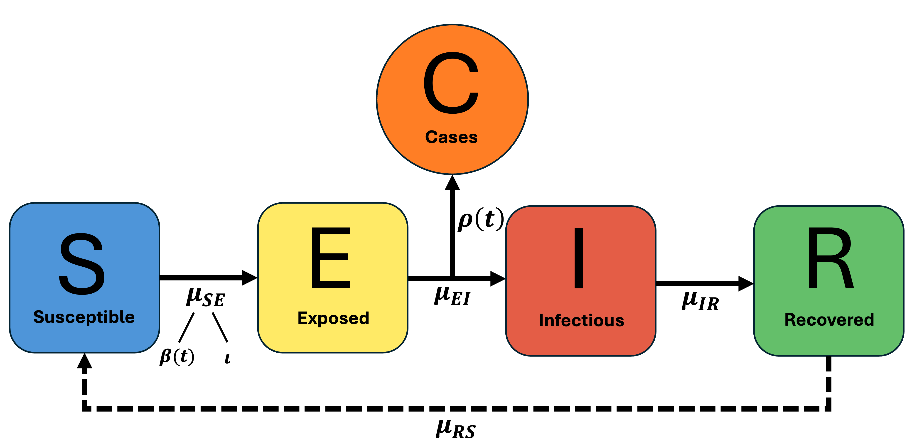

```{r echo=FALSE, include = FALSE, warnings = FALSE}
library(dplyr)
library(forecast)
library(readxl)
library(lubridate)
library(tidyr)
library(ggplot2)
library(kableExtra)

library(pomp)
library(tidyverse)
library(doParallel)
library(foreach)
library(doRNG)
```

# Introduction

The Coronavirus (COVID-19) disease is a highly infectious disease caused by the SARS-CoV-2 virus. The first case of COVID-19 in the United States was reported on January 20, 2020, and by March 11, 2020, the World Health Organization (WHO) declared COVID-19 to be a pandemic ^[https://www.cdc.gov/museum/timeline/covid19.html]. Given that the spread of COVID-19 occurs via airborne particles and droplets, governments were forced to take aggressive action to mitigate the spread of the virus. Various emergency measures such as regional lockdowns, mass testing, and mask mandates were enforced by many countries including the United States to reduce the transmission of the virus. 

Given that both group members are from the Midwest and have close ties to Michigan, we were particularly interested in studying how COVID-19 has spread in a highly populated county in Michigan that has yet to be analyzed by a previous group. Kent County is the fourth most populated county in Michigan and the largest county outside of the Detroit area. Hence, in this analysis, we focus on weekly COVID-19 cases in Kent County, Michigan from February 24, 2020 to March 11, 2024. We aim to construct a Susceptible-Exposed-Infected-Recovered-Susceptible (SEIRS) compartment model that is well-fit to the data. 

# Data

The COVID-19 data was extracted from a public use dataset containing the COVID-19 cases and deaths by county collected from the Michigan State government ^[https://www.michigan.gov/coronavirus]. Given that this dataset contained daily cases of COVID-19 for every county in Michigan, we filtered the dataset to Kent County then aggregated the daily data into weekly data. When converting the daily data to weekly data, we adjusted the corresponding date for each observation to be Monday of the respective week. A variable denoting the week number was also added to the data set.

Below, we display a time series plot of the COVID-19 cases over a 212 week long time period from February 24, 2020 to March 11, 2024. 

```{r echo = FALSE}
# Note: The dataset was originally named "Cases and Deaths by County and by Date of Symptom Onset or by Date of Death.xlsx", but we shortened the dataset name to "mi_covid.xlsx" 
mi_covid <- read_excel("mi_covid.xlsx")

# filter data to Kent County
data <- mi_covid %>% filter(COUNTY == 'Kent')

# aggregate daily data to weekly
week <- as.Date(cut(data$Date, "week"))
data_weekly <- aggregate(Cases ~ week, data, sum)
names(data_weekly)[names(data_weekly) == 'week'] <- 'Date'

# create a new column that numbers the weeks in the data
data_weekly$week_num <- seq(1, nrow(data_weekly))
```

```{r include = FALSE}
min(data_weekly$Date)
max(data_weekly$Date)
```

```{r include = FALSE}
head(data_weekly)
summary(data_weekly)
```

```{r fig1, echo = FALSE, fig.align='center', out.width="75%", fig.cap="Weekly COVID-19 Cases in Kent County"}
plot(Cases ~ Date, data = data_weekly, type = "l",
     ylab = "Number of Covid-19 Cases",
     xlab= "Date")
title("Weekly Covid-19 Cases in Kent County", line = 0.5)
```

We see two large peaks around November 2020 and January 2022 as well as a smaller peak around March 2021. From the United States COVID-19 timeline, a spike in cases was observed soon after the presidential election and other gatherings such as Halloween celebrations ^[https://www.cdc.gov/museum/timeline/covid19.html]. In March 2021, Michigan had its first case of the SARS-CoV-2 Beta variant and around January 2022, the SARS-CoV-2  Omicron variant became dominant in Michigan ^[https://covidmapping.org/timeline.html]. After May 2022 and up to March 2024, we see much fewer cases of COVID-19.

We continue our analysis by plotting the sample autocorrelation (ACF) plot of the data.

```{r acf1, echo = FALSE, fig.align='center', out.width="75%", fig.cap="ACF Plot of Weekly COVID-19 Cases"}
acf(data_weekly$Cases, main = "")
title("ACF Plot of Weekly Cases", line = 0.5)
```

We see that the autocorrelations are generally decreasing as lag increases. The autocorrelations are also outside the dotted blue lines throughout the entire plot which indicates that the data is correlated and confirms that the data is non-stationary. This provides motivation for exploring a time-dependent relationship of weekly COVID-19 cases via the Partially Observed Markov Process (POMP) compartment model framework.

As part of our exploratory data analysis, it may be helpful to identify if there are any cyclical patterns in the data. We plot a periodogram of the weekly cases below using the autoregressive (AR) method to estimate the spectral density. Note that this is a form of parametric spectral density estimation ^[https://lbelzile.github.io/timeseRies/spectral-estimation-in-r.html].

```{r ar-plot, echo = FALSE, fig.align='center', out.width="75%", fig.cap="Smoothed Periodogram"}
p_ar <- spectrum(data_weekly$Cases, method = 'ar', sub = "", 
                 xlab = "Frequency (1/weeks)", ylab = "Spectrum",
                 main = "")
title("Smoothed Periodogram AR(3)", line = 0.5)
```

```{r include = FALSE}
p_ar$freq[which.max(p_ar$spec)]
```

The periodogram shows that the spectral density is maximized at a frequency of 0, which indicates the absence of seasonality in the data. Hence, a seasonal auto-regressive moving-average (SARMA) model is not necessary for this analysis.

# ARMA Model as Benchmark

Before fitting a compartment model, we want to fit an auto-regressive moving-average (ARMA) model since non-mechanistic fits to the data can allow us to later assess the overall success of our compartment model by comparing its likelihood to that of the fitted ARMA model ^[Chapter 15, Slide 52]. Hence, we will fit an ARMA model to the $\text{log}(y^{*}_n + 1)$ transformed data then correct the likelihood back to the appropriate scale for the untransformed data.

## Log-Transformed Data {.tabset}

We first analyze the $\text{log}(y^{*}_n + 1)$ transformed data before fitting an ARMA model.

### Time Series Plot of Log of COVID-19 Cases

```{r log-figs1, echo = FALSE, fig.align='center', out.width="75%", fig.cap="Plot of Log-Transformed Data"}
plot(log(Cases+1) ~ Date, data = data_weekly, type = "l",
     ylab = "Log of Covid-19 Cases",
     xlab= "Date")
title("Log of Weekly Covid-19 Cases", line = 0.5)
```

### ACF Plot of Log of COVID-19 Cases

```{r log-figs2, echo = FALSE, fig.align='center', out.width="75%", fig.cap="ACF Plot of Log-Transformed Data"}
acf(log(data_weekly$Cases + 1), main = "")
title("ACF Plot of Log Weekly Cases", line = 0.5)
```

## {-}  

After the log transformation, the data does not appear to be stationary. Although differencing the data may allow us to achieve stationarity, we will opt out of doing so such that we can have a more comparable benchmark to our POMP model.

Additionally, the ACF plot of the transformed data exhibits similar characteristics to that of the non-transformed ACF plot. This indicates that our data is still heavily correlated and motivates the use of our POMP model and using the log-ARMA model as a benchmark model.

## AIC Table

If a time series $\text{log}(Y_{n} + 1)$ has a nonzero mean $\mu$, we can set $\alpha = \mu(1-\phi_1-...-\phi_p)$ and write the ARMA(p,q) model as follows:

$$\text{log}(Y_{n} + 1) = \alpha + \phi_{1} \text{log}(Y_{n-1} + 1) + ... + \phi_{p} \text{log}(Y_{n-p} + 1) + \epsilon_{n} + \psi_{1} \epsilon_{n-1} + ... + \psi_{q} \epsilon_{n-q}$$ 

where $\phi_{p} \ne 0$, $\psi_{q} \ne 0$, and $\sigma^2_{\epsilon} > 0$. We can also assume $\epsilon_{n}$ is a white noise process which follows $N(0, \sigma^2)$ ^[Chapter 3.2 (Page 92) of Time Series Analysis and Its Applications with R Examples]. Note that $\phi$ represents the autoregressive (AR) parameters and $\psi$ represents the moving average (MA) parameters, where $p$ is the order of the AR polynomial and $q$ is the order of the MA polynomial. 

To choose values of $p$ and $q$ for our benchmark model, we will fit multiple ARMA(p,q) models with various values for $p$ and $q$. We can then compare the ARMA(p,q) models using the Akaike Information Criterion (AIC). The AIC is given by:

$$ AIC = -2*\ell(\theta^{*}) + 2D$$
where $\ell(\theta^{*})$ is the maximized log-likelihood and $D$ is the number of parameters in the model ^[Chapter 5 Slide 21 Class Notes]. The AIC is often used for model selection, and by choosing the model with the lowest AIC, we can find the ARMA model that best fits the transformed data.

```{r, echo = FALSE}
arma_table <- function(data, P, Q){
  table <- matrix(NA, (P+1), (Q+1))
  for(p in 0:P){
    for(q in 0:Q){
       table[p+1, q+1] <- arima(data, order = c(p, 0, q))$aic
    }
  }
  dimnames(table) <- list(paste("<b> AR", 0:P, "</b>", sep = ""), paste("MA", 0:Q, sep = ""))
  table
}
```

```{r warning=FALSE, echo=FALSE}
log_y <- log(as.vector(data_weekly$Cases)+1)
aic_table <- arma_table(log_y, 4, 4)

rownames(aic_table) <- c("AR0", "AR1", "AR2", "AR3", "AR4")

kableExtra::kbl(round(aic_table, digits = 3), booktabs = T, linesep = "") %>%
  kableExtra::kable_styling(latex_options = "HOLD_position") %>%
  kableExtra::kable_classic()
```

We notice some inconsistencies in the AIC table above. Mathematically, adding a parameter to the ARMA model cannot decrease the maximized log-likelihood, so we should not see the AIC increase by more than 2 units ^[Chapter 5 Slide 30]. We see an example of an inconsistency in the table where the AIC increases by roughly 3.4 units from the ARMA(2,3) model to the ARMA(2,4) model. We notice other maximization failures from ARMA(3,3) to ARMA(3,4), ARMA(4,3) to ARMA(4,4), and ARMA(1,4) to ARMA(2,4).

The first row of the AIC table is also interesting since it appears that ARMA(0,q) models have much larger AIC values compared to the other fitted models. Additionally, for the first row of the table, the AIC decreases substantially from left to right and from ARMA(0,q) models to ARMA(1,q) models.

Due to inconsistencies in the AIC table, we will be careful not to choose models that are too large. The ARMA(2,1) model is associated with the lowest AIC score. We will also consider the ARMA(2,2) model as it is often used as a benchmark comparison and also has a low AIC score ^[Chapter 17, Slide 38].

## Model Fitting {.tabset}

We continue our analysis by fitting the ARMA(2,1) and ARMA(2,2) models to the $\text{log}(y^{*}_n + 1)$ transformed data. The model summaries are displayed below.

```{r echo=FALSE, warning=FALSE}
arma_mod21 <- arima(log_y,order=c(2,0,1))
arma_mod22 <- arima(log_y,order=c(2,0,2))
```

```{r include=FALSE}
summary(arma_mod21)
summary(arma_mod22)
```

```{r echo = FALSE, warning = FALSE}
ints_mod21 <- c(arma_mod21$coef[4])
ar1_coef_mod21 <- c(arma_mod21$coef[1])
ar2_coef_mod21 <- c(arma_mod21$coef[2])
ma1_coef_mod21 <- c(arma_mod21$coef[3])
ma2_coef_mod21 <- c(NA)

ints_mod22 <- c(arma_mod22$coef[5])
ar1_coef_mod22 <- c(arma_mod22$coef[1])
ar2_coef_mod22 <- c(arma_mod22$coef[2])
ma1_coef_mod22 <- c(arma_mod22$coef[3])
ma2_coef_mod22 <- c(arma_mod22$coef[4])

mod_table_mod21 <- data.frame(ints_mod21, ar1_coef_mod21, ar2_coef_mod21, ma1_coef_mod21, ma2_coef_mod21)
mod_table_mod21 <- mutate(mod_table_mod21, across(where(is.numeric), round, 4))
mod_table_mod21 <- data.matrix(mod_table_mod21)

mod_table_mod22 <- data.frame(ints_mod22, ar1_coef_mod22, ar2_coef_mod22, ma1_coef_mod22, ma2_coef_mod22)
mod_table_mod22 <- mutate(mod_table_mod22, across(where(is.numeric), round, 4))
mod_table_mod22 <- data.matrix(mod_table_mod22)

rownames(mod_table_mod21) <- c("ARMA(2,1)")
colnames(mod_table_mod21) <- c("Intercept", "AR 1 Coefficient", "AR 2 Coefficient",
                               "MA 1 Coefficient", "MA 2 Coefficient")

rownames(mod_table_mod22) <- c("ARMA(2,2)")
colnames(mod_table_mod22) <- c("Intercept", "AR 1 Coefficient", "AR 2 Coefficient",
                               "MA 1 Coefficient", "MA 2 Coefficient")

mod_table <- rbind(mod_table_mod21, mod_table_mod22)

kableExtra::kbl(mod_table, booktabs = T, linesep = "") %>%
  kableExtra::kable_styling(latex_options = "HOLD_position") %>%
  kableExtra::kable_classic()
```


Using the fitted values from the table, we can write the ARMA(2,1) and ARMA(2,2) models as follows:

$$\text{ARMA(2,1): } \text{log}(Y_{n} + 1) = \alpha + \phi_{1} \text{log}(Y_{n-1} + 1) + \phi_{2} \text{log}(Y_{n-2} + 1) + \epsilon_{n} + \psi_{1} \epsilon_{n-1}$$

$$\text{ARMA(2,2): } \text{log}(Y_{n} + 1) = \alpha + \phi_{1} \text{log}(Y_{n-1} + 1) + \phi_{2} \text{log}(Y_{n-2} + 1) + \epsilon_{n} + \psi_{1} \epsilon_{n-1} + \psi_{1} \epsilon_{n-2}$$
Note that if we use the backshift operator ^[Chapter 4 Slide 13 Class Notes] and denote $\phi(x)$ and $\psi(x)$ as the AR and MA polynomials respectively, we can rewrite the model as such:

$$\text{ARMA(2,1): } \phi(B)(\text{log}(Y_{n} + 1) - 4.8791) = \psi(B) \epsilon_n \\
\text{ where } \phi(x) = 1-1.7654x+0.7748x^2 \text{ and } \psi(x) = 1-0.3699x$$

$$\text{ARMA(2,2): } \phi(B)(\text{log}(Y_{n} + 1) - 4.8613) = \psi(B) \epsilon_n \\
\text{ where } \phi(x) = 1-1.7525x+0.7621x^2 \text{ and } \psi(x) = 1-0.3608x+0.0156x^2$$

We focus on the roots of the AR and MA polynomials from each model to determine causality and invertibility. An ARMA process is causal only when the roots of $\phi(x)$ lie outside the unit circle, and invertible only when the roots of $\psi(x)$ lie outside the unit circle ^[Chapter 3.2 (Page 95) of Time Series Analysis and Its Applications with R Examples].

### Inverse Roots of ARMA(2,1) 

```{r ir1, echo = FALSE, fig.align='center', fig.cap="ARMA(2,1) Inverse Roots"}
autoplot(arma_mod21, main = "Inverse Roots of ARMA(2,1)")
```

### Inverse Roots of ARMA(2,2) 

```{r ir2, echo = FALSE, fig.align='center', fig.cap="ARMA(2,2) Inverse Roots"}
autoplot(arma_mod22, main = "Inverse Roots of ARMA(2,2)")
```

## {-}  

For both models, the inverse roots of both $\phi(x)$ and $\psi(x)$ lie inside the unit circle. Hence, the roots of the AR and MA polynomials are outside the unit circle which indicates causality and invertibility. Although, it is important to note that the inverse AR roots for both models are quite close to the boundaries of the unit circle.

## Likelihood Ratio Test 

Finally, we will perform a Likelihood Ratio Test to choose between the two models. The Likelihood Ratio Test is given by the Wilks approximation, with the following null and alternative hypotheses:

$$H^{\langle 0\rangle}: \text{The ARMA(2,1) model is appropriate for the data}$$
$$H^{\langle 1\rangle}: \text{The ARMA(2,2) model is appropriate for the data}$$

The Wilks approximation asserts that:

$$\text{Under } H^{\langle 0\rangle} \text{, } \ell^{\langle 1\rangle} - \ell^{\langle 0\rangle} \approx (1/2)\chi^{2}_{D^{\langle 1\rangle}-D^{\langle 0\rangle}}$$

where $\ell^{\langle i\rangle}$ is the maximized log-likelihood under hypothesis $H^{\langle i\rangle}$ and $D^{\langle i\rangle}$ is the dimensions/number of parameters under hypothesis $H^{\langle i\rangle}$ ^[Chapter 5 Slide 19].

```{r include=FALSE}
test_stat <- arma_mod22$loglik - arma_mod21$loglik
1- pchisq(2*test_stat, df = 1)
```

After conducting the Likelihood Ratio Test, we get a test statistic of 0.012 and a p-value of 0.878. Since the p-value is larger than $\alpha = 0.05$, we fail to reject the null hypothesis and we conclude that the ARMA(2,1) model is more appropriate for the data.

## Model Diagnostics

We continue by analyzing the residuals of the ARMA(2,1) model and checking the validity of our model assumptions. If the model is correctly specified, the residuals should have the properties of white noise ^[Chapter 3.8 (Page 149) of Time Series Analysis and Its Applications with R Examples]. Hence, we will determine if the residuals of the model appear to have mean 0, constant variance, are uncorrelated, and normally distributed.

```{r arma-diag, echo = FALSE, fig.align='center', out.width="75%", fig.cap="ARMA(2,1) Diagnostic Plots"}
par(mar=c(4,4,2,2))
layout(matrix(c(1,2,3,3), 2, 2, byrow = TRUE))

plot(data_weekly$Date, arma_mod21$residuals, type = "l",
     ylab = "Residuals", xlab = "Date")
abline(h = 0, col = "red", lty = 2)
title("ARMA(2,1) Residuals", line = 0.5)

acf(arma_mod21$residuals, main = "")
title("ARMA(2,1) ACF Plot", line = 0.5)

par(mar=c(2,14,2,14))
qqnorm(arma_mod21$residuals, main = "")
qqline(arma_mod21$residuals)
title("QQ Plot of ARMA(2,1) Residuals", line = 0.5)
```

The ACF plot shows that our residuals are in fact uncorrelated, as there are no statistically significant lags in the plot. The QQ plot indicates that the distribution of our residuals have slightly heavier tails than the Normal distribution since some of the points on the tail ends deviate from the identity line. Lastly, from the plot of the residuals over time, the residuals are centered around zero. The variance also appears to be constant throughout the plot, however, it’s worth noting that the leading and trailing timepoints have larger residuals than the rest of the data. 

After fitting an ARMA(2,1) model to the transformed data, we correct the likelihood back to the appropriate scale for the non-transformed data. The model provides a log-likelihood of -1371.5. We aim to construct a SEIRS model with a larger log-likelihood than -1371.5.

```{r include=FALSE}
arma_mod21$loglik-sum(log_y)
```

# SEIRS Model

```{r echo=FALSE}
cores = as.numeric(Sys.getenv('SLURM_NTASKS_PER_NODE'), unset = NA)
if(is.na(cores)) cores <- detectCores()
registerDoParallel(cores)
registerDoRNG(19283571)
```
  
```{r include=FALSE}
run_level <- 3
Np <- switch(run_level,100, 1e3, 5e3)
Nmif <- switch(run_level, 10, 100, 200)
Nreps_eval <- switch(run_level, 2, 10, 20)
Nreps_local <- switch(run_level, 10, 20, 40)
Nsim <- switch(run_level, 50, 100, 500)
Nglobal <- switch(run_level, 5, 15, 200)
```

We chose to develop deterministic and stochastic representations of a Susceptible-Exposed-Infection-Recovered-Susceptible (SEIRS) system which is a fundamental class of models for disease transmission dynamics ^[Chapter 12, Slide 4]. Given that the COVID-19 virus continues to mutate, we believe it would be reasonable that individuals who have recovered from COVID-19 would become susceptible again as their body has not encountered the new variant yet. Additionally, the level of protection that COVID-19 vaccines offer typically diminishes after 12 months ^[https://www.idsociety.org/covid-19-real-time-learning-network/infection-prevention/faq-why-do-i-keep-getting-covid/#/+/0/publishedDate_na_dt/desc/].

## Model Specification

The compartments within the SEIRS model which represent the flow of COVID-19 transmissions are illustrated below. Note that the dashed line shows how the SEIR model can be extended to the SEIRS model, where recovered individuals may become susceptible again, which may more accurately reflect COVID-19 transmissions. 

```{r seirs-pic, echo=FALSE, out.width="75%", fig.align="center", fig.cap="SEIRS Model Diagram"}

```

We suppose that each arrow pointing to a compartment has an associated transition rate. The four rates are defined as follows:

- $\mu_{SE}$ the rate at which individuals in *S* transition to *E*
- $\mu_{EI}$: the rate at which individuals in *E* transition to *I*
- $\mu_{IR}$ the rate at which individuals in *I* transition to *R*
- $\mu_{RS}$ the rate at which individuals in *R* transition to *S*

The number of people in each compartment can be computed via counting processes. Suppose the number of people in each compartment at time $t$ is $S(t)$, $E(t)$, $I(t)$, and $R(t)$, respectively. The model (ignoring demography) is specified below ^[Chapter 12, Slide 10]. Note that our time series starts at $t=1$ and we fix the population size, $N$.

$$\begin{split}
S(t) &= S(1) + N_{RS}(t)-N_{SE}(t) \\ 
E(t) &= E(1) + N_{SE}(t) - N_{EI}(t) \\
I(t) &= I(1) + N_{EI}(t) - N_{IR}(t) \\
R(t) &= R(1) + N_{IR}(t) - N_{RS}(t) \\
\end{split}$$

where $N = S(t) + E(t) + I(t) + R(t)$. The movement between compartments are defined as follows:

$$\begin{split}
\Delta N_{SE} &\sim Binomial(S,1-e^{-\frac{\beta(t)}{N}(I+\iota)\zeta(t)}) \\ 
\Delta N_{EI} &\sim Binomial(E,1-e^{-\mu_{EI}\Delta t}) \\ 
\Delta N_{IR} &\sim Binomial(I,1-e^{-\mu_{IR}\Delta t}) \\ 
\Delta N_{RS} &\sim Binomial(R,1-e^{-\mu_{RS}\Delta t}) \\ 
\end{split}$$

As seen in the diagram above, we introduce time-varying transmission rates and reporting rates denoted by $\beta(t)$ and $\rho(t)$, respectively. Note that in the piecewise functions below, the intervals for $t$ denote the week numbers from the dataset.

The time-varying transmission rates are specified below:

$$
\begin{equation}
\beta(t)=
    \begin{cases}
        b_1 & \text{if } t \in [1,54] &\text { , 02/24/2020 - 03/01/2021}\\
        b_2 & \text{if } t \in (54, 72] &\text{ , 03/01/2021 - 07/05/2021}\\
        b_3 & \text{if } t \in (72, 212] &\text{ , 07/05/2021 - 03/11/2024}
    \end{cases}
\end{equation}
$$

Referring back to Figure \@ref(fig:fig1), which displays the time series plot of the weekly COVID-19 cases, we noticed peaks that matched the rise of certain variants which could be tracked as separate transmission rates. We determine the transmission rates as follows:

- The first main peak in Figure \@ref(fig:fig1) occurs around spring 2021 (pre-Beta variant), so we introduce the first parameter $b_1$ for that time period under the assumption that most variants before Beta have similar transmission rates. Hence, for our first time interval, we aim to find a $b_1$ that would best generalize the transmission rate seen before the presence of the Beta variant. 

- During the second time interval, we observed another peak in Figure \@ref(fig:fig1) which occurred around the time that the Beta variant was being transmitted between individuals, so we aim to estimate a new transmission rate $b_2$ for this time period.

- Finally, our last time interval coincides with the Delta and Omicron variants, which the state of Michigan identified as the dominant variants in June 2021, and January 2022 respectively ^[https://covidmapping.org/timeline.html]. Hence, we estimate a third transmission rate $b_3$ for this time period. Given that this time period contains the largest peak in weekly cases in Figure \@ref(fig:fig1), we suspect that $b_3$ will be the largest of the three transmission rates.

Next, we construct a piecewise function to define three different intervals of reporting rates.

$$
\begin{equation}
\rho(t)=
    \begin{cases}
        \rho_1 & \text{if } t \in [1,54] &\text { , 02/24/2020 - 03/01/2021}\\
        \rho_2 & \text{if } t \in (54, 125] &\text { , 03/01/2021 - 07/11/2022}\\
        \rho_3 & \text{if } t \in (125, 212] &\text{ , 07/11/2022 - 03/11/2024}
    \end{cases}
\end{equation}
$$

- Given that our time series starts in February 2020, we hypothesize that in the first time interval, 
there was likely a lower reporting rate since aggressive action towards mitigating the spread of COVID-19 such as the Michigan Stay Home, Stay Safe order was not enforced until late March 2020 ^[https://covidmapping.org/timeline.html]. Additionally, in early 2020, COVID-19 testing methods were not as well-defined and easily accessible compared to 2021.

- For the second time interval, we suspect a higher reporting rate since the lockdown was lifted and testing was typically mandatory for any in-person work-setting or gathering. 

- Lastly, for the third time interval, we suspect another drop in the reporting rate since masking and vaccine requirements have become optional. This is likely to lead to a reduction in individuals being tested for COVID-19, and therefore a smaller reporting rate.

In an effort to improve the fit of our model, we include additional complexities such as overdispersion and an importation component ($\iota$) to account for the natural force of infection. This considers individuals who travel in and out of Kent County and infect others. Hence, we include extra-demographic stochasticity in the form of a Gamma white-noise term which acts multiplicatively on the force of infection ^[Chapter 17, Slide 15]. 

- Force of Infection: $\mu_{SE}(t) = \frac{\beta(t)}{N(t)}(I+ \iota)^{\alpha}\zeta(t)$ 
    - $\iota$: imported infections 
    - $\zeta(t)$: Gamma white noise with intensity $\sigma_{SE}$
    - Note that we set $\alpha = 1$ ^[Chapter 17, Slide 52].

Finally, to model the reported observations, we implement a discretized normal distribution, truncated at zero, with both environmental and Poisson-scale contributions to the variance ^[Chapter 15, Slide 16].

$$
Y_n = \text{max}\{\text{round}(Z_n), 0\}, \qquad Z_n \sim \ N(\rho (t)  H, (\tau H)^2 +\rho (t) H )
$$ 

```{r warning=FALSE, echo = FALSE}
seirs_step <- Csnippet("
  double Beta = (wave > 0) ? (wave==2) ? b3 : b2 : b1; 
  
    // expected force of infection
  double foi = (Beta*(I+iota))/N;
  
  // white noise (extrademographic stochasticity)
  double dw = rgammawn(sigmaSE,dt);
  
  double dN_SE = rbinom(S,1-exp(-foi*dw));
  double dN_EI = rbinom(E,1-exp(-mu_EI*dt));
  double dN_IR = rbinom(I,1-exp(-mu_IR*dt));
  double dN_RS = rbinom(R,1-exp(-mu_RS*dt));
  S += dN_RS - dN_SE;
  E += dN_SE - dN_EI;
  I += dN_EI - dN_IR;
  R += dN_IR - dN_RS;
  H += dN_IR;
  W += (dw - dt)/sigmaSE;
")

seirs_rinit <- Csnippet("
  S = nearbyint(eta*N);
  E = 0;
  I = 1;
  R = nearbyint((1-eta)*N)-I;
  H = 0;
  W = 0;
")

seirs_dmeas <- Csnippet("
  if(rep_int == 0){
  double tol=1.0e-25;
  double mean_cases =rho1*H;
  double sd_cases =sqrt(pow(tau*H,2)+mean_cases);
  if(reports>0.0){
    lik=pnorm(reports+0.5,mean_cases,sd_cases,1,0)-pnorm(reports-0.5,mean_cases,sd_cases,1,0)+tol;
  } else {
    lik=pnorm(reports+0.5,mean_cases,sd_cases,1,0)+tol;
  }
  if(give_log) lik=log(lik);
  } else if(rep_int == 1){
  double tol=1.0e-25;
  double mean_cases =rho2*H;
  double sd_cases =sqrt(pow(tau*H,2)+mean_cases);
  if(reports>0.0){
    lik=pnorm(reports+0.5,mean_cases,sd_cases,1,0)-pnorm(reports-0.5,mean_cases,sd_cases,1,0)+tol;
  } else {
    lik=pnorm(reports+0.5,mean_cases,sd_cases,1,0)+tol;
  }
  if(give_log) lik=log(lik);
  } else {
  double tol=1.0e-25;
  double mean_cases =rho3*H;
  double sd_cases =sqrt(pow(tau*H,2)+mean_cases);
  if(reports>0.0){
    lik=pnorm(reports+0.5,mean_cases,sd_cases,1,0)-pnorm(reports-0.5,mean_cases,sd_cases,1,0)+tol;
  } else {
    lik=pnorm(reports+0.5,mean_cases,sd_cases,1,0)+tol;
  }
  if(give_log) lik=log(lik);
  }
")

seirs_rmeas <- Csnippet("
  if(rep_int == 0){
    reports = rnorm(rho1*H, sqrt(pow(tau*H,2)+rho1*H));
    if(reports>0.0){
      reports=nearbyint(reports);
    } else {
      reports=0.0;}
  } else if(rep_int == 1){
    reports = rnorm(rho2*H, sqrt(pow(tau*H,2)+rho2*H));
      if(reports>0.0){
        reports=nearbyint(reports);
      } else {
        reports=0.0;}
  } else{
    reports = rnorm(rho3*H, sqrt(pow(tau*H,2)+rho3*H));
      if(reports>0.0){
        reports=nearbyint(reports);
      } else {
        reports=0.0;}
  }
")

seirs_covar <- covariate_table(
  t = data_weekly$week_num,
  wave= c(rep(0, 54), # a bit before delta hit hard
          rep(1, 18), 
          rep(2, 140)),
  rep_int = c(rep(0,54), # start of 2021
              rep(1,71), # feb of 2022
              rep(2,87)),
  times = "t")

data_weekly %>%
  select(week_num, reports=Cases) %>% 
  pomp(
    times="week_num", t0=1,
    rmeasure=seirs_rmeas,
    dmeasure=seirs_dmeas,
    accumvars="H",
    rprocess=euler(seirs_step,delta.t=1/7),
    rinit=seirs_rinit,
    partrans=parameter_trans(
      log = c("mu_EI", "mu_RS", "mu_IR", "b1", "b2", "b3", "tau", "sigmaSE", "iota"),
      logit = c("rho1", "rho2", "rho3", "eta") 
    ),
    paramnames=c("N","b1", "b2", "b3", "rho1", "rho2", "rho3", "mu_EI", "mu_RS", "mu_IR","eta", "tau", "sigmaSE", "iota"),
    statenames=c("S","E","I","R","H","W"),
    covar = seirs_covar
  ) -> kentSEIRS
```

## Model Assumptions and Initial Guesses

We begin by fixing the population size of Kent County, $N$, to be 659,000 ^[https://datacommons.org/place/geoId/26081?utm_medium=explore&mprop=count&popt=Person&hl=en]. Our initial parameter guesses are listed below. The units for $b_1$, $b_2$, $b_3$, $\mu_{IR}$, $\mu_{EI}$, $\mu_{RS}$, and $\iota$ are $\text{weeks}^{-1}$.

$$
\begin{equation}
    \begin{cases}
        N = 659,000,\\
        b_1 = 3, b_2 = 2, b_3 = 3 ,\\
        \mu_{IR} = 1.5, \mu_{EI}=1, \mu_{RS}=0.02,\\
        \rho_1=0.3, \rho_2=0.7, \rho_3=0.15,\\
        \tau = 0.001,\\
        \eta=0.6,\\
        \sigma_{SE}=0.25,\\
        \iota=10 \\
    \end{cases}
\end{equation}
$$

As reflected in our initial guesses above (and previously discussed), we expect $b_3$ and $\rho_2$ to be the largest transmission rate and largest reporting rate, respectively. Additionally, the typical incubation period for COVID-19 is roughly 7 days where individuals are typically infectious for 5-7 days starting up to 2 days prior to showing symptoms ^[https://www.webmd.com/covid/coronavirus-incubation-period]. Our initial guess assumes a longer incubation period with individuals becoming infectious after 7 days, with the infectious period lasting two-thirds of a week ^[https://sesamecare.com/blog/how-long-are-you-contagious-with-covid-19]. Hence, we set $\mu_{EI} = 1$ and $\mu_{IR} = 1.5$.

It’s important to note that although a majority of the population should be susceptible to COVID-19 at the start of our time-series, we choose to start with a lower value of $\eta$ due to the lockdown that occurred during 2020. Using the fact that vaccines typically last for about 12 months before their effectiveness diminishes, we figure that setting $\mu_{RS}= 0.02 \text{ weeks}^{-1}$, which corresponds to a 50 week period (roughly 1 year), would capture our hypothesis.

```{r echo=FALSE, warning=FALSE}
kent_county_pop <- 659000

params <- c(N=kent_county_pop, 
            b1=3, b2=2, b3=3, 
            mu_IR=1.5, mu_EI = 1, mu_RS=0.02,
            rho1=0.3, rho2 = 0.7, rho3 = 0.15,
            tau=0.001,
            eta=0.6,
            sigmaSE = 0.25, 
            iota = 10)

fixed_params = params[c("N")]

coef(kentSEIRS, names(params)) <- params
```

```{r include=FALSE}
coef(kentSEIRS)
```

We continue by plotting simulations using our initial values.

```{r init-plot, echo=FALSE, fig.align="center", fig.cap="SEIRS Initial Parameter Simulations"}
set.seed(12)
kentSEIRS |>
  simulate(params=params,nsim=20,format="data.frame",include.data=TRUE) |>
  ggplot(aes(x=week_num,y=reports,group=.id,color=.id=="data")) +
  geom_line()+
  labs(title="Initial Parameter Simulations",
       x = "Week Number", y = "Reports") +
  scale_color_discrete(name="Legend",
                       labels=c("Simulated Data", "Observed Data")) + 
  theme(legend.position="right")
```

Using our initial parameters, it appears that we are able to match the locations of the three peaks, but overestimate their magnitude, especially for the third peak at week 99 (January 10, 2022). The simulations drastically die down after week 125 (July 11, 2022), which matches the behavior of the observed data.

## Local Search {.tabset}

```{r include=FALSE}
# check that the basic particle filter is working, this code is not needed in the report
set.seed(12546)
kentSEIRS |>
  pfilter(Np=Np) -> pf1
logLik(pf1)

plot(pf1)

min(as(pf1, 'data.frame')$ess)
```

```{r include=FALSE}
# carry out replicated particle filters
set.seed(1235)
foreach(i=1:30,.combine=c) %dopar% {
  library(pomp)
  kentSEIRS |>pfilter(Np=Np)
} -> pf

# compute the likelihood at a single point
pf |> logLik() |> logmeanexp(se=TRUE) -> L_pf
L_pf
```

```{r, echo=FALSE, message=FALSE}
# store this point with the est. likelihood and standard error in a csv file
pf[[1]] |> coef() |> bind_rows() |>
  bind_cols(loglik=L_pf[1],loglik.se=L_pf[2]) |>
  write_csv("covid_params.csv")
```

We now conduct a local search starting from our initial parameters using iterated filtering. We perform 200 iterations using 5,000 particles, replicating this process 40 times (`Np = 5e3`, `Nmif=200`, `Nreps_local=40`). The random walk perturbations are set to 0.02 for all of the parameters where $\eta$ is the only initial value parameter and we set `cooling.fraction.50=0.4`.

```{r echo=FALSE}
params_rw.sd = rw_sd(b1 = ifelse(data_weekly$week_num < 54, 0.02, 0),
                     b2 = ifelse((data_weekly$week_num >= 54) & (data_weekly$week_num < 72), 0.02, 0),
                     b3 = ifelse(data_weekly$week_num >= 72, 0.02, 0),

                     mu_IR = 0.02,
                     mu_EI = 0.02,
                     mu_RS = 0.02,

                     rho1 = ifelse(data_weekly$week_num < 54, 0.02, 0),
                     rho2 = ifelse((data_weekly$week_num >= 54) & (data_weekly$week_num < 125), 0.02, 0),
                     rho3 = ifelse(data_weekly$week_num >= 125, 0.02, 0),
                     
                     tau = 0.02,
                     eta=ivp(0.02),
                     sigmaSE = 0.02,
                     iota=0.02)
```

```{r echo=FALSE}
registerDoRNG(12531)
bake(file="lev3_mifs_local.rds",{
  foreach(i=1:Nreps_local,.combine=c) %dopar% {
    kentSEIRS |>
      mif2(params = params, Np=Np, Nmif=Nmif,
           cooling.fraction.50=0.4, rw.sd=params_rw.sd)
  }
}) -> local_mifs
```

We show the diagnostic plots of our local search below.

```{r local-diag, echo=FALSE, fig.align="center", fig.cap="Local Search Diagnostic Plots"}
local_mifs |>
  traces() |>
  melt() |>
  ggplot(aes(x=iteration,y=value,group=.L1,color=factor(.L1)))+
  geom_line()+
  guides(color="none")+
  facet_wrap(~name,scales="free_y")
```

In the log-likelihood plot, we see signs of convergence since overall, the lines are increasing before plateauing around a log-likelihood of roughly -1,500. It is also important to note that the y-axis tick marks in our log-likelihood plot are only about 1,000 units apart, so even though there are a few lines below -1,500 such as the green and blue lines, it is still near the area of convergence.

Other than the log-likelihood plot, we can see that most of our parameters don’t converge and are weakly identifiable, except for $\mu_{IR}$, $\iota$, and $\sigma_{SE}$, which show slight convergence. While this is not a problematic result, it is worth noting that we could find several parameter sets that are able to maximize the likelihood. Note that the plot for $N$ is constant since we chose to fix $N$.

```{r echo=FALSE}
registerDoRNG(123123515)
bake(file="lev3_seirs_local_search.rds",{
  foreach(mf=local_mifs,.combine=rbind) %dopar% {
    evals <- replicate(Nreps_eval, logLik(pfilter(mf,Np=Np)))
    ll <- logmeanexp(evals,se=TRUE)
    mf |> coef() |> bind_rows() |>
      bind_cols(loglik=ll[1],loglik.se=ll[2])
  }
}) -> local_results
```

```{r, echo=FALSE, message=FALSE}
read_csv("covid_params.csv") |>
  bind_rows(local_results) |>
  arrange(-loglik) |>
  write_csv("covid_params.csv")
```

The parameters from the best result of our local search is displayed below. The best local result provides a log-likelihood estimate of -1413.6 with a Monte Carlo standard error of 0.266.

```{r echo=FALSE}
best_local <- local_results %>%
  arrange(-loglik) %>%
  slice(1)

round(best_local, 3)
```

```{r include=FALSE}
max(local_results$loglik)
local_results$loglik.se[which(local_results$loglik == max(local_results$loglik, na.rm = TRUE))]
```

Next, we attempt to visualize the geometry of the likelihood surface using a scatterplot matrix. Given that our model contains many parameters, we create three separate pairs plots for ease of readability.

### Pairs Plot 1

```{r ls-p1, echo=FALSE, fig.align="center", fig.cap="Local Search Pairs Plot 1"}
pairs(~ loglik + b1 + b2 + b3, data = local_results |> filter(loglik>max(loglik)-30) , pch = 16)
```

### Pairs Plot 2

```{r ls-p2, echo=FALSE, fig.align="center", fig.cap="Local Search Pairs Plot 2"}
pairs(~ loglik + rho1 + rho2 + rho3 + eta, data = local_results |> filter(loglik>max(loglik)-30), pch = 16)
```

### Pairs Plot 3

```{r ls-p3, echo=FALSE, fig.align="center", fig.cap="Local Search Pairs Plot 3"}
pairs(~ loglik + mu_IR + mu_EI + mu_RS, data = local_results |> filter(loglik>max(loglik)-30), pch = 16)
```

## {-}

The first pairs plot from the local search shows that the likelihoods reach a peak/ceiling. We can also see that the different transmission rate parameters form a ridge and are positively correlated with one another. In the second pairs plot, we observe evidence of a ridge in the likelihood surface for $\rho_1$ and $\rho_2$. In the last pairs plot, we do not observe ridges in the likelihood between the transition rates.

## Global Search {.tabset}

Next, we conduct a global search to find the optimal solution by randomly sampling starting points within intuitive ranges of the parameters. The ranges are as follows:

$$
\begin{equation}
    \begin{cases}
        b_1 \in (0,5),\\
        b_2 \in (0,10),\\
        b_3 \in (0,15),\\
        \mu_{IR}, \mu_{EI} \in (0,2),\\
        \mu_{RS} \in (0,0.1),\\
        \rho_1, \rho_2, \rho_3, \eta \in (0,1),\\
        \tau \in (0,0.1),\\
        \sigma_{SE} \in (0,0.5),\\
        \iota \in (0,250)
    \end{cases}
\end{equation}
$$


```{r echo=FALSE}
freeze(runif_design(lower=c(b1=0, b2=0, b3=0, 
                            mu_IR = 0, mu_EI=0, mu_RS=0,
                            rho1=0, rho2=0, rho3=0, 
                            eta=0, tau=0, sigmaSE=0, iota=0),
                    upper=c(b1=5, b2=10, b3=15, 
                            mu_IR = 2, mu_EI=2, mu_RS=0.1,
                            rho1=1, rho2=1, rho3=1, 
                            eta=1, tau=0.1, sigmaSE=0.5,iota=250),
                    nseq=Nglobal), seed=13528397)-> guesses
```

Our global search consisted of performing 200 iterations of filtering with 5,000 particles for 200 different starting points (`Np = 5e3`, `Nmif=200`, `Nglobal=200`). 


```{r echo=FALSE}
registerDoRNG(12531)

mf1 = local_mifs[[1]]

bake(file="lev3_mifs_global.rds",{
  foreach(guess=iter(guesses,"row"),.combine=c) %dopar% {
    mf1 |>
      mif2(params = c(guess, fixed_params), Np=Np, Nmif=Nmif,
           cooling.fraction.50=0.4, rw.sd=params_rw.sd) 
  }
}) -> global_mifs
```

```{r echo=FALSE}
registerDoRNG(123123515)
bake(file="lev3_seirs_global_search.rds",{
  foreach(mf=global_mifs,.combine=rbind) %dopar% {
    evals <- replicate(Nreps_eval, logLik(pfilter(mf,Np=Np)))
    ll <- logmeanexp(evals,se=TRUE)
    mf |> coef() |> bind_rows() |>
      bind_cols(loglik=ll[1],loglik.se=ll[2])
  }
}) -> global_results
```

Below, we print out the top 6 results found from the global search. The optimal global search result provided a log-likelihood estimate of -1404.0 with a Monte Carlo standard error of 0.249 which is 9.6 log units better than the best local search result. From the output below, it appears that the values for $\rho_1$, $\rho_2$, $\rho_3$, and $\iota$ in the top 6 rows vary quite a bit.

```{r echo=FALSE}
global_results <- global_results %>% arrange(-loglik) %>% head
round(global_results, 3)
```

```{r include=FALSE}
max(global_results$loglik, na.rm = TRUE)
global_results$loglik.se[which(global_results$loglik == max(global_results$loglik, na.rm = TRUE))]
```

We continue by further analyzing the parameters from our optimal global search result.

```{r echo=FALSE}
global_optim_params <- global_results[which(global_results$loglik == max(global_results$loglik, na.rm = TRUE)), ]
round(global_optim_params, 3)
```

From the optimal global parameters, we notice that the values for $b_1$, $b_2$, and $b_3$ match our hypothesis as the transmission rates have increased over time with $b_3$ having the largest transmission rate. This confirms the expectation that the COVID-19 variants have become more contagious over time.

The three reporting rates also increase over time where $\rho_1$ has the lowest reporting rate of roughly 0.27 while $\rho_3$ has the highest reporting rate of roughly 0.58. This goes against our hypothesis that $\rho_2$ would have the highest reporting rate, although it is the second highest. Additionally, the value of $\eta$ is approximately 0.89 which indicates a high susceptibility fraction and confirms that a majority of the population is susceptible to COVID-19. However, this contradicts our initial thoughts that it wouldn’t be this high, due to the lockdown.

The values of $\mu_{EI}$, $\mu_{IR}$, and $\mu_{RS}$ have all decreased from our initial parameter estimates. This indicates that our hypothesized incubation, infectious, and recovery periods are shorter compared to what we have found from our optimal global search. In fact, the value of $\mu_{RS}$ is so close to 0 that we question its inclusion in the construction of our model because a recovery period of roughly 20 years is not intuitive. This suggests that moving from a SEIR to SEIRS framework may not provide impactful results as we initially expected. 

The value of $\iota$ is also quite high in our optimal global search which means that a larger number of individuals are moving from the susceptible to infectious compartments within the model. A higher value of $\iota$ indicates that there is an infectious population traveling into Kent County and spreading the disease. This could include infectious front-line/essential workers who commute into the county for work.

To assess the performance of our SEIRS model, we perform 5 simulations using the optimal global parameters and plot them against the non-transformed and log-transformed data, respectively. 

### Non-Transformed Simulations

```{r sim1, echo=FALSE, fig.align="center", fig.cap="SEIRS Model Simulations on Non-Transformed Data"}
set.seed(989)

kentSEIRS |>
  simulate(params=global_optim_params,
           nsim=5,format="data.frame",include.data=TRUE) |>
  ggplot(aes(x=week_num,y=reports,group=.id,color=.id=="data")) +
  geom_line()+
  labs(title="Model Simulations on Non-Transformed Data",
       x = "Week Number",
       y="Reports")+
  scale_color_discrete(name="Legend",
                       labels=c("Simulated Data", "Observed Data")) + 
  theme(legend.position="right")
```

### Log-Transformed Simulations

```{r sim2, echo=FALSE, fig.align="center", fig.cap="SEIRS Model Simulations on Log-Transformed Data"}
set.seed(989)

kentSEIRS |>
  simulate(params=global_optim_params,
           nsim=5,format="data.frame",include.data=TRUE) |>
  ggplot(aes(x=week_num,y=log(reports+1),group=.id,color=.id=="data")) +
  geom_line()+
  labs(title="Model Simulations on Log-Transformed Data",
       x = "Week Number",
       y="Log(Reports+1)")+
  scale_color_discrete(name="Legend",
                       labels=c("Simulated Data", "Observed Data")) + 
  theme(legend.position="right")
```

## {-}

The simulations in red appear to properly capture the observed data in both the non-transformed and transformed data. In the plot of the transformed data, there is one simulation with a higher number of cases near the end of the time series where the observed data is relatively flat. However, it appears that overall, we can now capture both the location and the magnitude of the peaks in the number of cases. 

```{r, echo=FALSE, message=FALSE}
read_csv("covid_params.csv") |>
  bind_rows(global_results) |>
  filter(is.finite(loglik)) |>
  arrange(-loglik) |>
  write_csv("covid_params.csv")
```

## SEIRS Model Diagnostics {.tabset}

We attempt to visualize the global geometry of the likelihood surface using a scatterplot matrix. The starting values are shown in grey while the IF2 estimates are colored in red. Again, we create three separate pairs plots below for ease of readability.

### Pairs Plot 1

```{r gs-p1, echo=FALSE, message=FALSE, fig.align="center", fig.cap="Global Search Pairs Plot 1"}
read_csv("covid_params.csv") |>
  filter(loglik>max(loglik)-100) |>
  bind_rows(guesses) |>
  mutate(type=if_else(is.na(loglik),"guess","result")) |>
  arrange(type) -> all
pairs(~loglik + b1 + b2 + b3, data=all, pch=16, col=ifelse(all$type=="guess",grey(0.5),"red"))
```

### Pairs Plot 2

```{r gs-p2, echo=FALSE, message=FALSE, fig.align="center", fig.cap="Global Search Pairs Plot 2"}
read_csv("covid_params.csv") |>
  filter(loglik>max(loglik)-100) |>
  bind_rows(guesses) |>
  mutate(type=if_else(is.na(loglik),"guess","result")) |>
  arrange(type) -> all
pairs(~loglik + rho1 + rho2 + rho3 + eta, data=all, pch=16,
      col=ifelse(all$type=="guess",grey(0.5),"red"))
```

### Pairs Plot 3

```{r gs-p3, echo=FALSE, message=FALSE, fig.align="center", fig.cap="Global Search Pairs Plot 3"}
read_csv("covid_params.csv") |>
  filter(loglik>max(loglik)-100) |>
  bind_rows(guesses) |>
  mutate(type=if_else(is.na(loglik),"guess","result")) |>
  arrange(type) -> all
pairs(~loglik + mu_IR + mu_EI + mu_RS, data=all, pch=16,
      col=ifelse(all$type=="guess",grey(0.5),"red"))
```

## {-}

Overall, in all three pairs plots, we see little signs of convergence for most parameters. However, in the first pairs plot, the plot of the log-likelihood against $b_3$ shows signs of convergence and the points have a slight quadratic shape. In the second pairs plot, we notice some convergence in the plots of the log-likelihood against $\rho_3$ and $\eta$ since the log-likelihoods appear to plateau for larger values of both $\rho_3$ and $\eta$. In the third pairs plot, we do not see convergence in the transition rates.

As part of our model diagnostics, we also display convergence plots of the effective sample size and conditional log-likelihood below.

```{r global-diag, fig.keep='first', echo=FALSE, fig.align="center", fig.cap="Global Search Diagnostic Plot"}
plot(global_mifs)
```

The effective sample size and conditional log-likelihood plots show that there are points of failure in our filtering. This could indicate that our model is misspecified at those time points, or that we have a data issue. Since most of the failures coincide with the holiday season or common times of gathering, there could be something problematic occurring in our model or in the data. An example could be that during the week of Christmas and New Years, the reporting rate might drop significantly, but then the week after, reports will increase significantly more than expected. Remedies to address this issue will be discussed later.

# Profile Likelihood

We continue our analysis by calculating a profile likelihood over $\rho_3$. We first bound the uncertainty by putting a box around the highest likelihood estimates we have found so far. Within this box, we will choose random starting points for several values of $\rho_3$ ^[Chapter 14, Slide 53].

```{r echo=FALSE, message=FALSE}
read_csv("covid_params.csv") |>
  filter(loglik>max(loglik)-50) |>
  bind_rows(guesses) |>
  mutate(type=if_else(is.na(loglik),"guess","result")) |>
  arrange(type) -> all
```

```{r include=FALSE, echo=FALSE}
filter(global_results,loglik>max(loglik)-20) |>
  sapply(range) -> box
box
```

```{r echo=FALSE}
freeze(seed=610408798,
       profile_design(
         rho3=seq(0,1,by=0.1),
         lower=box[1,c("b1", "b2", "b3", "rho1", "rho2", "mu_IR", "mu_EI", "mu_RS", "eta", "tau", "sigmaSE", "iota")],
         upper=box[2,c("b1", "b2", "b3", "rho1", "rho2", "mu_IR", "mu_EI", "mu_RS", "eta", "tau", "sigmaSE", "iota")],
         nprof=50, type="runif")) |>
  mutate(N=659000) -> guesses
```

```{r echo=FALSE}
registerDoRNG(32059683)
bake(file="lev3_rho3_profile.rds",{
  foreach(guess=iter(guesses,"row"), .combine=rbind) %dopar% {
      mf1 |> mif2(params=c(guess,fixed_params),
                  rw.sd=params_rw.sd) -> mf
      replicate(
        Nreps_eval,
        mf |> pfilter(Np=Np) |>logLik()) |>
        logmeanexp(se=TRUE) -> ll
      mf |> coef() |> bind_rows() |>
        bind_cols(loglik=ll[1],loglik.se=ll[2])
      } -> prof_results
  prof_results
}) -> profile_results_rho3

profile_results_rho3 |> filter(is.finite(loglik)) -> profile_results_rho3
```

```{r message=FALSE, echo=FALSE}
read_csv("covid_params.csv") |>
  bind_rows(profile_results_rho3) |>
  filter(is.finite(loglik)) |>
  arrange(-loglik) |>
  write_csv("covid_params.csv")
```

```{r prof-rho3, echo=FALSE, out.width="75%", fig.align="center", fig.cap="Profile Likelihood Over Reporting Rate 3"}
profile_results_rho3 |>
  filter(is.finite(loglik)) |>
  group_by(round(rho3,5)) |>
  filter(rank(-loglik)<3) |>
  ungroup() |>
  filter(loglik>max(loglik)-20) |>
  ggplot(aes(x=rho3,y=loglik))+
  labs(title = "Profile Likelihood Over Reporting Rate 3",
       x="Reporting Rate 3 (rho3)", y="Log-Likelihood")+
  geom_point() +
  geom_hline(
    color="red",
    yintercept=max(profile_results_rho3$loglik)-0.5*qchisq(df=1,p=0.95))
```

```{r echo=FALSE, include=FALSE}
profile_results_rho3 |>
    filter(loglik>max(loglik)-0.5*qchisq(df=1,p=0.95)) |>
    summarize(min=min(rho3),max=max(rho3)) -> rho3_ci

rho3_ci
```

The 95% confidence interval for $\rho_3$ is 0.37 to 1. The profile likelihood plot shows only 4 points above the threshold in red which may result in a dubious interval. This could be a result of weak identifiability in most of our model parameters.

# Benchmark Comparison

```{r echo=FALSE}
log_lik_table <- data.frame(arma_mod21$loglik-sum(log_y), max(global_results$loglik, na.rm = TRUE))
log_lik_table <- mutate(log_lik_table, across(where(is.numeric), round, 2))
log_lik_table <- data.matrix(log_lik_table)
rownames(log_lik_table) <- c("Log-Likelihood")
colnames(log_lik_table) <- c("ARMA(2,1) Model", "SEIRS Model")

kableExtra::kbl(log_lik_table, booktabs = T, linesep = "") %>%
  kableExtra::kable_styling(latex_options = "HOLD_position") %>%
  kableExtra::kable_classic()
```


From the log-likelihood table above, our SEIRS model fails to outperform the ARMA(2,1) benchmark model since its log-likelihood is 32.5 log units below that of the benchmark model. While this is not a desired result, this does bring to light the difficulties in appropriately modeling the COVID-19 pandemic. 

# Conclusion

In our analysis, we fit a SEIRS model to the weekly COVID-19 cases in Kent County from February 24, 2020 to March 11, 2024. After performing local and global searches, we were able to find a model which adequately fit both the non-transformed and log-transformed data.

Despite the lack of improvement over our benchmark model, the log-likelihood of our SEIRS model is quite close to that of the log-ARMA model. We went beyond the work of past COVID-19 projects by implementing a new SEIRS model, introducing new variables within the model, most notably the overdispersion factor to the force of infection, and including the importation parameter $\iota$. We also introduced time-varying reporting rates to our model in addition to time-varying transmission rates, whereas previous projects only included time-varying transmission rates. Additionally, our objective was to see if we could effectively model the entire time period of the COVID-19 pandemic, which meant that we had to capture multiple peaks in our data, corresponding to different outbreaks of infection.

If we had more time to further develop the model, we would want to incorporate three new additions. One of the additions would be to estimate the initial values for our model compartments, allowing us to more effectively start the model with the correct populations within each compartment. Also, the weak identifiability found in most of our model parameters may lead us to explore the possibility of fixing more parameters rather than only fixing $N$. Lastly, we could also experiment with different ways to fix the failures in Figure \@ref(fig:global-diag) during the holidays. We could fix this by generating new reporting rate parameters, or even transmission rates during these times that are more capable of capturing the COVID-19 pandemic during the holiday season. 

# References

[1] Belzile, L. (n.d.). Spectral Estimation in R. 4.3 Spectral Estimation in R. https://lbelzile.github.io/timeseRies/spectral-estimation-in-r.html 

[2] CDC Museum COVID-19 Timeline, www.cdc.gov/museum/timeline/covid19.html. 

[3] “Coronavirus.” SOM - State of Michigan, www.michigan.gov/coronavirus. 

[4] “Covid-19 Incubation Period.” WebMD, WebMD, 24 Feb. 2020, www.webmd.com/covid/coronavirus-incubation-period. 

[5] “FAQ: Why Do I Keep Getting COVID?” IDSA Home, www.idsociety.org/covid-19-real-time-learning-network/infection-prevention/faq-why-do-i-keep-getting-covid/#/+/0/publishedDate_na_dt/desc/. 

[6] [Ionides, Edward. Analysis of Time Series Chapter 4 Lecture Slides](https://ionides.github.io/531w24/04/slides.pdf)

[7] [Ionides, Edward. Analysis of Time Series Chapter 5 Lecture Slides](https://ionides.github.io/531w24/05/slides.pdf)

[8] “Kent County.” Kent County - Place Explorer - Data Commons, datacommons.org/place/geoId/26081?utm_medium=explore&mprop=count&popt=Person&hl=en. 

[9] [King, Aaron and Ionides, Edward. Analysis of Time Series Chapter 12 Lecture Slides](https://kingaa.github.io/sbied/stochsim/slides.pdf)

[10] [King, Aaron and Ionides, Edward. Analysis of Time Series Chapter 15 Lecture Slides](https://kingaa.github.io/sbied/polio/slides.pdf)

[11] [King, Aaron and Ionides, Edward. Analysis of Time Series Chapter 17 Lecture Slides](https://kingaa.github.io/sbied/measles/slides.pdf)

[12] “Michigan COVID-19 Timeline.” Michigan COVID-19 Tracker, covidmapping.org/timeline.html. 

[13] Rosenfield, Leah, and MD Dr. Tito Suero-Salvador. “How Long Are You Contagious with Covid-19?” Sesame, Sesame, 6 Dec. 2023, sesamecare.com/blog/how-long-are-you-contagious-with-covid-19. 

[14] Shumway, R. H., & Stoffer, D. S. (2006). Time Series Analysis and Its Applications with R Examples. New York: Springer.

[15] [Time Series Analysis of COVID-19 Cases in Washtenaw County](https://ionides.github.io/531w22/final_project/project09/final_proj_531.html)

[16] [US COVID-19 Cases Analysis](https://ionides.github.io/531w22/final_project/project17/blinded.html)

[17] [Sunspots](https://ionides.github.io/531w24/midterm_project/project09/blinded.html)
- Note: This reference was used for HTML formatting tips.


