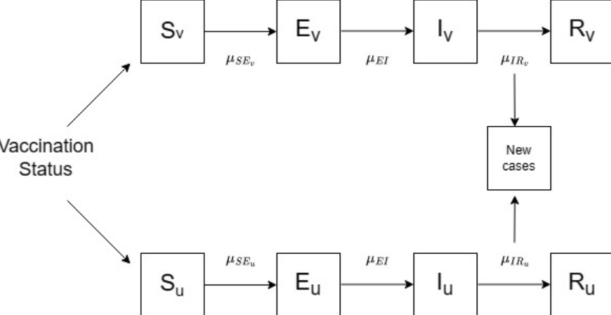

```{=html}
<style>
body {
  font-size: 18px;
  line-height: 2;
  font-family: Helvetica, Arial, sans-serif;
}

p {
  margin-bottom: 2em;
}

li {
  margin-bottom: -1.5em;
}
</style>
```
```{r setup, include=FALSE}
knitr::opts_chunk$set(echo = TRUE)
```

```{r, include=FALSE}
library(readr)
library(tidyverse)
library(stringr)
# install.packages("pomp")
library(pomp)
library(ggplot2)
library(dplyr)
#install.packages("doFuture")
library(doFuture)
library(foreach)
library(doParallel)
library(doRNG)

#parallel::detectCores()

registerDoParallel(4)
# registerDoRNG(542451)  # Any integer to set reproducible seed

#install.packages("forecast")
library(forecast)

set.seed(2488820)
```

# Introduction

In this study, we explore the impact of vaccination on the transmission and progression of influenza, focusing on the differing rates of change and associated risks between vaccinated and unvaccinated populations. We have chosen The Netherlands for our analysis due to its compact geography and high population density, providing a rich dataset for our investigation.

While an ARIMA model was initially considered to understand flu data trends, this approach was inadequate for capturing the complex dynamics of influenza transmission. To gain deeper insights, we developed a new SEIR (Susceptible, Exposed, Infectious, Recovered) model specifically designed for this context. This custom SEIR model separates the vaccinated and unvaccinated groups, allowing us to study their individual transmission dynamics and how vaccination affects the rate of infection.

Our innovative SEIR model accounts for key factors like vaccination rates and different susceptibilities among population segments, enabling a more detailed analysis of flu transmission. This separation between vaccinated and unvaccinated groups allows us to examine the impact of vaccination on flu spread with greater precision. By introducing this new approach, we aim to provide a clearer understanding of the role of vaccination in controlling influenza, ultimately offering a comprehensive perspective on flu dynamics and informing public health strategies.

```{r, include=FALSE}
# flu <- read_csv("/content/Flu.csv")
flu <- read_csv("https://media.githubusercontent.com/media/ZhenningZhang/Stats-531-Final-WN24/main/Flu.csv", show_col_types = FALSE)

fluNL <- flu %>%
  filter(str_detect(str_to_lower(`COUNTRY/AREA/TERRITORY`), "netherlands"))

fluNL <- fluNL %>%
  mutate(week = row_number())

fluNL <- fluNL[,c("ISO_SDATE", "week", "INF_ALL")]

fluNL %>% replace(is.na(.), 0) -> fluNL

fluNL[100: 198, ] -> fluNL_nonsentinel
fluNL[1:99, ] -> fluNL_sentinel

# get subset of 2022-2023 flu season for modeling
flu_2022_2023 <- subset(fluNL_sentinel, ISO_SDATE >= as.Date("2022-10-01") & ISO_SDATE <= as.Date("2023-05-31"))

# Create a new column in flu_2022_2023 that represents the difference in INF_ALL
flu_2022_2023 <- flu_2022_2023 %>%
  arrange(ISO_SDATE) %>%  # Ensure data is ordered by date
  mutate(INF_DIFF = c(NA, diff(INF_ALL)))  # Compute the difference in INF_ALL

fluNL_sentinel <- fluNL_sentinel %>%
  arrange(ISO_SDATE) %>%  # Ensure data is ordered by date
  mutate(INF_DIFF = c(NA, diff(INF_ALL)))  # Compute the difference in INF_ALL
```

# Data

The data for this analysis was sourced from the World Health Organization (WHO), covering weekly observations from 2022 through April 2024. This dataset includes a range of columns with information related to influenza cases, such as WHO region, country codes, origin source, ISO year, ISO week, and other indicators of influenza activity. For our analysis, we specifically focus on the 'INF_ALL' column, which represents the total count of all detected influenza cases. This simplified approach provides a clear view of overall influenza trends.

We chose to analyze data from The Netherlands due to its smaller size, making the study more manageable compared to larger countries like the United States. The Netherlands' compact geographic scope and relatively uniform healthcare system allow for a streamlined analysis while still yielding valuable insights into national influenza trends. This decision helps us maintain focus while reducing complexities associated with analyzing larger, more diverse countries.

The ORIGIN_SOURCE column in the dataset indicates the source of the data, with two possible values: "SENTINEL" and "NONSENTINEL." "SENTINEL" data is collected from specific healthcare providers or clinics that are part of a network designed to monitor disease trends, offering a focused and consistent source of information. "NONSENTINEL" data comes from a broader range of healthcare facilities. For our analysis, we chose Sentinel data to ensure the consistency and quality of the dataset, given its specialized focus on tracking influenza activity.

To align with a full influenza season, we narrowed the dataset to include only the data where ISO_SDATE ranges from October 1, 2022, to May 31, 2023. This period is generally recognized as encompassing the beginning and end of the influenza season in the Northern Hemisphere, allowing for a complete analysis of flu transmission patterns during this critical timeframe. By focusing on this interval, we capture the peak of the influenza season, providing a comprehensive view of the transmission dynamics and trends over the course of a full cycle.

# EDA

The time series plot of influenza cases indicates a sharp rise in cases from late fall to early winter, with a peak around early January, followed by a gradual decline through the spring. This trend suggests that flu activity increases during colder months, following a typical transmission pattern. However, because the data encompasses only one transmission period, identifying consistent seasonal patterns could be challenging.

```{r, echo=FALSE}
flu_2022_2023 %>%
  ggplot(aes(x = ISO_SDATE, y = INF_ALL)) + geom_line() + ggtitle("The Netherlands Flu 2022-2023")
```

An Autocorrelation Function (ACF) plot was used to investigate the underlying structure of the data. The plot reveals significant positive autocorrelation at early lags, suggesting a strong relationship between adjacent observations. This behavior points to a clear trend, with autocorrelation decreasing gradually at higher lags, indicating diminishing influence of earlier data points over time.

```{r, echo=FALSE}
acf(flu_2022_2023$INF_ALL, main = "The Netherlands Flu 2022-2023 ACF Plot")
```

Given the observed trend, the data was initially differenced to address non-stationarity. However, the differenced plot showed significant fluctuations and oscillations, indicating that differencing might not fully resolve the complexities in the data. A further ACF plot of the differenced data displayed varying autocorrelation levels, suggesting underlying behaviors not entirely captured through simple differencing.

```{r, echo=FALSE}
flu_2022_2023 %>%
  ggplot(aes(x = ISO_SDATE, y = INF_DIFF)) + geom_line() + ggtitle("The Netherlands Flu 2022-2023 Difference")
```

```{r, echo=FALSE}
acf(flu_2022_2023$INF_DIFF, na.action = na.pass, main = "The Netherlands Flu 2022-2023 Difference ACF Plot")
```

While ARIMA with a seasonal component (SARIMA) could be an appropriate model for capturing clear seasonal patterns, the analysis revealed that the data did not exhibit a consistent seasonal structure when using auto ARIMA with seasonality. This could be attributed to the dataset covering only one transmission period, limiting the ability to detect seasonality across multiple cycles.

Considering these insights, the analysis will proceed with ARMA or ARIMA models to model the trend and autocorrelation without explicitly focusing on seasonality. These models will serve as a reference for understanding the data's behavior. However, the primary modeling focus will be on the pomp SEIR model, which is designed to capture the transmission dynamics of infectious diseases and provides a more comprehensive approach to analyzing influenza data.

# ARIMA

## Auto ARIMA {.tabset}

AutoARIMA was used to explore the best-fitting ARIMA model for the influenza data from The Netherlands 2022-2023 season. The initial AutoARIMA forecast displayed considerable limitations, with a flat forecast and wide confidence intervals suggesting high uncertainty in predictions. This outcome indicated that conventional ARIMA models might struggle to capture the complex dynamics and variability in the data, pointing to potential oscillations and underlying cyclic patterns.

### Fit

```{r, echo=FALSE}
fit = auto.arima(flu_2022_2023$INF_ALL, seasonal = T)
fit
```

### Forcast

```{r, echo=FALSE}
plot(forecast(fit,h=20))
```

##  {.unnumbered}

## AIC Tables {.tabset}

To further investigate ARIMA models, an Akaike Information Criterion (AIC) table was generated, testing various combinations of autoregressive (AR) and moving average (MA) components, both with and without differencing (d=0 and d=1).

### d = 0

```{r, warning=FALSE, echo=FALSE}
aic_table <- function(data, P, Q){
  table <- matrix(NA, (P+1), (Q+1))
  for (p in 0 : P){
    for (q in 0 : Q){
      table[p+1, q+1] <- arima(data, order = c(p, 0, q))$aic
    }
  }
  dimnames(table) <- list(paste("AR", 0 : P, sep = ""),
                          paste("MA", 0 : Q, sep = ""))
  table
}

aic_table <- aic_table(flu_2022_2023$INF_ALL, 4, 4)
knitr::kable(aic_table, digits = 2)
```

### d = 1

```{r, echo=FALSE}
aic_table <- function(data, P, Q){
  table <- matrix(NA, (P+1), (Q+1))
  for (p in 0 : P){
    for (q in 0 : Q){
      table[p+1, q+1] <- arima(data, order = c(p, 1, q))$aic
    }
  }
  dimnames(table) <- list(paste("AR", 0 : P, sep = ""),
                          paste("MA", 0 : Q, sep = ""))
  table
}

aic_table_de <- aic_table(flu_2022_2023$INF_ALL, 4, 4)
knitr::kable(aic_table_de, digits = 2)
```

##  {.unnumbered}

## Best Model From AIC

The AIC table identified ARIMA(0,1,4) as the best model based on the lowest AIC value. However, when this model was used to create a forecast plot, the results still showed wide confidence intervals and high variability, indicating considerable uncertainty in predicting future values. The flat forecast, combined with these large confidence intervals, suggests that even the optimal ARIMA model (regardless of utilization of Auto.ARIMA or AIC table) failed to capture the true structure of the influenza data.

## ARIMA(0,1,4) {.tabset}

### Fit

```{r, echo=FALSE}
AIC_fit = arima(flu_2022_2023$INF_ALL, order = c(0, 1, 4))
AIC_fit
```

### Forcase

```{r, echo=FALSE}
plot(forecast(AIC_fit,h=20))
```

##  {.unnumbered}

## Model Diagnostics {.tabset}

Model diagnostics provided further insights into the performance of the ARIMA model. The QQ-plot for the residuals showed deviations from the expected linear trend, indicating potential non-normality and suggesting that the residuals might not meet the assumptions of the ARIMA model. Additionally, the residual plot exhibited oscillations and spikes, indicating that the model might not fully capture the dynamics of the data.

### Autoplot

```{r, echo=FALSE}
autoplot(AIC_fit)
```

### Residual Plot

```{r, echo=FALSE}
plot(residuals(AIC_fit), ylab = "residuals")
```

### QQ Plot

```{r, echo=FALSE}
qqnorm(residuals(AIC_fit), main = "QQ-plot")
qqline(residuals(AIC_fit))
```

##  {.unnumbered}

## ARIMA Conclusions

Given these results, it's clear that conventional ARIMA models struggle to accurately model this influenza dataset. The observed limitations in the forecast plot, combined with the diagnostic insights, suggest that a more robust modeling approach is required. Consequently, the analysis shifts focus towards the pomp SEIR model, which is designed for modeling infectious disease transmission and can better address the inherent complexities and cyclic behavior in flu data.

# POMP Model

Due to the compartmental nature of viruses, we elected to pivot from the ARIMA model to the SEIR model. Influenza has been shown to have a brief incubation period between the susceptible and infectious period, which is why we chose the SEIR model, rather than the SIR model.

Additionally, one key component of the flu transmission is the vaccine distribution. Vaccinations have been shown to reduce "the risk of flu illness by between 40% and 60% among the overall population" (Vaccine). Additionally, the flu vaccine has been shown to "reduce severity of illness in people who get vaccinated but still get sick" (Vaccine). Due to these factors, it would be wise to use separate SEIR models to model those that get vaccinated and those that are unvaccinated in the Netherlands. We are then able to aggregate these two models to model the entire population. Below is a diagram of our model:



We initialize our susceptible population as follows, where $v$ indicates vaccinated and $u$ indicates unvaccinated, and $\eta$ is the susceptible proportion in the population. The reason for using $\eta$ when modeling the flu is that some subsets of the population are more susceptible to contracting the flu, regardless of vaccination status, such as in children or immunocompormized individuals (Vaccine):

$$S_{v} = (\text{vaccinationRate} * \eta_{v} * N)$$

$$S_{u} = (\text{vaccinationRate} * \eta_{u} * N)$$

Similar to in class, we elected to use a binomial approximation with exponential transition probabilities to model the flow between compartments.

```{r, include=FALSE}
# Initialization function for vaccinated and unvaccinated compartments
seir_rinit <- Csnippet("
  S_v = nearbyint(vac_rate * eta_v * N);
  E_v = 0;
  I_v = 1;
  R_v = 0;


  S_u = nearbyint((1-vac_rate) * eta_u * N);
  E_u = 0;
  I_u = 1;
  R_u = 0;


  H = 0;
")


# Density measurement model for likelihood calculation
seir_dmeas <- Csnippet("
  double total_H = rho * H;
  lik = dnbinom_mu(INF_ALL, k, total_H, give_log);
")


# Random measure model for simulated data generation
seir_rmeas <- Csnippet("
  INF_ALL = rnbinom_mu(k, rho * H);
")


# SEIR step function for both vaccinated and unvaccinated compartments
seir_step <- Csnippet("
  double dN_SE_v = rbinom(S_v, 1 - exp(-Beta_v * I_v / N * dt));
  double dN_EI_v = rbinom(E_v, 1 - exp(-mu_EI * dt));
  double dN_IR_v = rbinom(I_v, 1 - exp(-mu_IR_v * dt));
  S_v -= dN_SE_v;
  E_v += dN_SE_v - dN_EI_v;
  I_v += dN_EI_v - dN_IR_v;
  R_v += dN_IR_v;


  double dN_SE_u = rbinom(S_u, 1 - exp(-Beta_u * I_u / N * dt));
  double dN_EI_u = rbinom(E_u, 1 - exp(-mu_EI * dt));
  double dN_IR_u = rbinom(I_u, 1 - exp(-mu_IR_u * dt));
  S_u -= dN_SE_u;
  E_u += dN_SE_u - dN_EI_u;
  I_u += dN_EI_u - dN_IR_u;
  R_u += dN_IR_u;


  H += dN_IR_v + dN_IR_u;
")


# POMP model
fluSEIR <- pomp(
  data = flu_2022_2023,
  times = "week",
  t0 = 0,
  rprocess = euler(seir_step, delta.t = 1/7),
  rinit = seir_rinit,
  rmeasure = seir_rmeas,
  dmeasure = seir_dmeas,
  accumvars = "H",
  statenames = c("S_v", "E_v", "I_v", "R_v", "S_u", "E_u", "I_u", "R_u", "H"),
  paramnames = c("Beta_v", "Beta_u", "mu_EI", "mu_IR_v", "mu_IR_u", "rho", "k", "N", "eta_v", "eta_u", "vac_rate"),
  params=c(Beta_v=2, Beta_u=4.5, mu_IR_v=0.8, mu_IR_u=0.6, mu_EI=0.35, rho=0.2, k=10,
           eta_v=0.7, eta_u=.9, vac_rate=.679, N=17700000)
)

```

# Result

We held the vaccination rate, which in 2023 in the Netherlands was 67.9%, and the population size, N = 17,700,000, constant in our model. The rest of our parameters, $\beta_v$, $\beta_u$, $\mu_{EI}$, $\mu_{IR_u}$, $\mu_{IR_v}$, $\rho$, $k$, $\eta_v$, $\eta_u$ we estimated using particle filtering, below

```{r, echo=FALSE}
fluSEIR |>
pfilter(Np=1000, params=c(Beta_v=2, Beta_u=5, mu_IR_v=0.8, mu_IR_u=0.6, mu_EI=0.3, rho=0.2, k=10,
             eta_v=0.6, eta_u=.8, vac_rate=.679, N=17700000)) -> pf

plot(pf)
```

```{r}
foreach(i=1:10,.combine=c,
c("pomp")
) %dopar% {
library(pomp)
fluSEIR |> pfilter(Np=5000, params=c(Beta_v=2, Beta_u=5, mu_IR_v=0.8, mu_IR_u=0.6, mu_EI=0.3, rho=0.2, k=10,
             eta_v=0.6, eta_u=.8, vac_rate=.679, N=17700000))
} -> pf
pf |> logLik() |> logmeanexp(se=TRUE) -> L_pf
L_pf
```

```{r, include=FALSE}
fixed_params <- c(N=17700000, vac_rate=.679,  k=10)
coef(fluSEIR,names(fixed_params)) <- fixed_params

fluSEIR |>
  pfilter(Np=10000, params=c(Beta_v=2, Beta_u=5, mu_IR_v=0.8, mu_IR_u=0.6, mu_EI=0.3, rho=0.2, k=10,
                             eta_v=0.6, eta_u=.8, vac_rate=.679, N=17700000)) -> pf

# POMP model
fluSEIR <- pomp(
  data = flu_2022_2023,
  times = "week",
  t0 = 0,
  rprocess = euler(seir_step, delta.t = 1/7),
  rinit = seir_rinit,
  rmeasure = seir_rmeas,
  dmeasure = seir_dmeas,
  accumvars = "H",
  statenames = c("S_v", "E_v", "I_v", "R_v", "S_u", "E_u", "I_u", "R_u", "H"),
  paramnames = c("Beta_v", "Beta_u", "mu_EI", "mu_IR_v", "mu_IR_u", "rho", "k", "N", "eta_v", "eta_u", "vac_rate"),
      params=c(Beta_v=2, Beta_u=4.5, mu_IR_v=0.8, mu_IR_u=0.6, mu_EI=0.35, rho=0.2, k=10,
             eta_v=0.7, eta_u=.9, vac_rate=.679, N=17700000)
)

```

```{r, echo=FALSE}
foreach(i=1:4,.combine=c,
.packages = c("pomp")
) %dopar% {
fluSEIR |>
mif2(
Np=2000, Nmif=300,
cooling.fraction.50=0.2,
rw.sd=rw_sd(Beta_v=0.15, Beta_u=0.15, mu_IR_v=0.08, mu_IR_u=0.08, mu_EI=0.08, rho=0.05, eta_v=ivp(0.02),eta_u=ivp(0.02)),
partrans=parameter_trans(log=c("Beta_v","Beta_u", "mu_EI", "mu_IR_v","mu_IR_u"),logit=c("rho","eta_u","eta_v")),
paramnames=c("Beta_v","Beta_u", "rho","eta_v", "mu_EI", "mu_IR_v","mu_IR_u","eta_u")
)
} -> mifs_local

```

```{r, echo=FALSE}

mifs_local |>
  traces() |>
  melt() |>
  ggplot(aes(x=iteration,y=value,group=.L1,color=factor(.L1)))+
  geom_line()+
  guides(color="none")+
  facet_wrap(~name,scales="free_y")
```

We use the Great Lakes Cluster to run a more computationally intesive suite of POMP models, which results are then analyzed to find the transmission rates that best fit the data given our model.

```         
# Great Lakes run

runif_design(
lower=c(Beta_v=1.0, Beta_u=1.0, mu_IR_v=0.1, mu_IR_u=0.2, mu_EI=0.1, rho=0.1,
        eta_v=0.0, eta_u=0.0),
upper=c(Beta_v=50.0, Beta_u=50.0, mu_IR_v=0.3, mu_IR_u=0.9, mu_EI=5, rho=0.5,
        eta_v=1.0, eta_u=1.0),
nseq=400
) -> guesses

mf1 <- mifs_local[[1]]

bake(file=paste0(results_dir,"global_search.rds"),{
registerDoRNG(12345)
foreach(guess=iterators::iter(guesses,"row"), .combine=rbind,
.packages = c("pomp")
) %dopar% {
library(pomp)
library(tidyverse)
mf1 |>
mif2(params=c(guess,fixed_params)) |>
mif2(Nmif=1000) -> mf
replicate(
10,
mf |> pfilter(Np=10000) |> logLik()
) |>
logmeanexp(se=TRUE) -> ll
mf |> coef() |> bind_rows() |>
bind_cols(loglik=ll[1],loglik.se=ll[2])
} -> results
```

```{r, include=FALSE}
profile_results <- read_rds("global_search.rds")
profile_results %>%
    filter(is.finite(loglik)) -> profile_results

profile_results$ratio_beta <- profile_results$Beta_v/profile_results$Beta_u
profile_results$ratio_mu <- profile_results$mu_IR_v/profile_results$mu_IR_u
```

The negative log likelihood in these runs reach a maximum (likelihood minimum) at:

```{r, echo=FALSE}
logmeanexp(profile_results$loglik,se=TRUE)
```

Just to have a quick visualization of the pair plots of the whole run:

```{r, echo=FALSE}
pairs(~loglik+Beta_u+Beta_v+mu_EI+mu_IR_v+mu_IR_u+eta_v+eta_u,data=profile_results,pch=16)
```

We can focus on the parameters of interest with high log likelihood:

```{r, echo=FALSE}
runif_design(
lower=c(Beta_v=1.0, Beta_u=1.0, mu_IR_v=0.1, mu_IR_u=0.2, mu_EI=0.1, rho=0.1,
        eta_v=0.0, eta_u=0.0),
upper=c(Beta_v=50.0, Beta_u=50.0, mu_IR_v=0.3, mu_IR_u=0.9, mu_EI=5, rho=0.5,
        eta_v=1.0, eta_u=1.0),
nseq=400
) -> guesses

profile_results |>
filter(loglik>max(loglik)-10) |>
bind_rows(guesses) |>
mutate(type=if_else(is.na(loglik),"guess","result")) |>
arrange(type) -> all
pairs(~loglik+mu_IR_v+mu_IR_u+Beta_u+Beta_v, data=all, pch=16, cex=0.8)
```

If we take a closer look to the profile likelihood to the transmission rates from Susceptible to Exposed states ($\beta$) parameters, the transmission for vaccinated people clusters at lower values.

```{r, echo=FALSE}
profile_results %>%
  filter(loglik>max(loglik)-15) %>%
  group_by(round(Beta_v,2.0)) %>%
  filter(rank(-loglik)<3) %>%
  ungroup() %>%
  ggplot(aes(x=Beta_v,y=loglik))+
  geom_point()+
  geom_hline(
    color="red",
    yintercept=max(profile_results$loglik)-0.5*qchisq(df=1,p=0.95)
  )+
coord_cartesian(xlim = c(0, 40))
```

```{r, echo=FALSE}
profile_results %>%
  filter(loglik>max(loglik)-15) %>%
  group_by(round(Beta_u,2)) %>%
  filter(rank(-loglik)<3) %>%
  ungroup() %>%
  ggplot(aes(x=Beta_u,y=loglik))+
  geom_point()+
  geom_hline(
    color="red",
    yintercept=max(profile_results$loglik)-0.5*qchisq(df=1,p=0.95)
  )+
coord_cartesian(xlim = c(0, 40))
```

Since our goal is to compare the rate of infection of vaccinated versus unvaccinated people, we use the ratio between the $\beta$ values, i.e., $\frac{\beta_v}{\beta_u}$ to see which ones are more likely to get sick. A value lower than 1 indicates that the rate at which unvaccinated people are exposed and then get sick is faster than the one at which vaccinated people get the flu.

```{r, echo=FALSE}
 profile_results %>%
    filter(loglik>max(loglik)-10) %>%
    group_by(round(ratio_beta,2.0)) %>%
    filter(rank(-loglik)<3) %>%
    ungroup() %>%
    ggplot(aes(x=ratio_beta,y=loglik))+
    geom_point()+
    geom_hline(
      color="red",
      yintercept=max(profile_results$loglik)-0.5*qchisq(df=1,p=0.95)
    )+
  xlab("Ratio beta_v/beta_u")+
  coord_cartesian(xlim = c(0, 2.5))
```

Interestingly for the transition between Infected to Restored states, the rates for vaccinated people ($\mu_{IR_v}$) seem to be lower than the one for unvaccinated people ($\mu_{IR_u}$), which could mean that even though vaccinated people are less likely to get infected, the ones that do get infected take longer to recover. A possible explanation could be that they are population at risk or with pre-existing conditions.

```{r, echo=FALSE}
 profile_results %>%
    filter(loglik>max(loglik)-10) %>%
    group_by(round(mu_IR_v,2.0)) %>%
    filter(rank(-loglik)<3) %>%
    ungroup() %>%
    ggplot(aes(x=mu_IR_v,y=loglik))+
    geom_point()+
    geom_hline(
      color="red",
      yintercept=max(profile_results$loglik)-0.5*qchisq(df=1,p=0.95)
    )+
  coord_cartesian(xlim = c(0, 2.5))
```

```{r, echo=FALSE}
 profile_results %>%
    filter(loglik>max(loglik)-10) %>%
    group_by(round(mu_IR_u,2.0)) %>%
    filter(rank(-loglik)<3) %>%
    ungroup() %>%
    ggplot(aes(x=mu_IR_u,y=loglik))+
    geom_point()+
    geom_hline(
      color="red",
      yintercept=max(profile_results$loglik)-0.5*qchisq(df=1,p=0.95)
    )+
  coord_cartesian(xlim = c(0, 2.5))
```

We then apply the same reasoning to evaluate the ratios for the recovery rates between vaccinated and unvaccinated people, which is: $\frac{\mu_{IR-v}}{\mu_{IR-u}}$. Again if the value is lower than one the recovery is faster for vaccinated people and if it is larger than one, sick unvaccinated people recover faster.

```{r, echo=FALSE}
profile_results %>%
  filter(loglik>max(loglik)-15) %>%
  group_by(round(ratio_mu,2)) %>%
  filter(rank(-loglik)<3) %>%
  ungroup() %>%
  ggplot(aes(x=ratio_mu,y=loglik))+
  geom_point()+
  geom_hline(
    color="red",
    yintercept=max(profile_results$loglik)-0.5*qchisq(df=1,p=0.95)
  )+
 xlab("Ratio mu_IR_v/mu_IR_u")+
coord_cartesian(xlim = c(0, 2.5))
```

From the ''pairs'' plots is it observe that the highest log likelihood values are reached when the $\beta_{v}$ is very low, while $\beta_{u}$ has a broaded spread, which is also observed in the panel between those two parameters, where $\mu_{IR_v}$ is concentrated in low values. This proves that vaccinations effectively slows down the transmission rate of the flu in healthy people.

# Conclusion and Discussion

## Conclusion

Our main focus is that the transition for vaccinated and unvaccinated shows some differences based on the recovered parameters, i.e., $\beta_{v}$, $\beta_{u}$ and $\mu_{IR_v}$, $\mu_{IR_u}$.

The fact that $\beta_{v}$\< $\beta_{u}$ does not only mean that the vaccine works, in the sense of avoiding people getting sick, but it also slows down the rate at which the disease spreads. A slower disease-spread is key to not saturate the healthcare system and avoid people suffering more severe condition or even death due to the lack of healthcare attention. Therefore, from a societal point of view, population's vaccination helps in controlling the spread of diseases, keeping people healthy and avoiding unnecessary pressure over the healthcare system.

We also found that $\mu_{IR_v}$ seems to be slighlty lower than $\mu_{IR_u}$ as well, this means that vaccinated people that actually get sick take longer to recover. As we proposed above, it is possible that the vaccinated people that get the disease may have other preexisting conditions or already be vulnerable and with weakened inmuen systems, although further modeling would be required to explore this.

## Discussion

In terms of modelling the role of vaccines in the spread of transmission diseases, other approaches could have been attempted, since ours is not unique.

Certain analysis ideas that could be attempted is to explore the minimal vaccination rate and vaccine effectiveness required to control the peak of infected people at any given time. Possible benchmarks between the vaccine effectiveness achieved in lab trials can be compared with the one observed from our model. Splitting the population ranges can be relevant to assess the effectivity of the vaccine between age groups or preexisting conditions. That knowledge could be key in the design of public health policies and vaccinations campaigns.

A different approach to the POMP model could be used ratios in the overall population instead of dividing the SEIR model into two branches. By doing that, we could retrieved the number of vaccinated people on a given population if we know the effectiveness of the vaccine and the history of infected cases over time. Depending on the information required one of the other approach could be more beneficial in terms of achieving an improvement in public health policies and vaccines development by reaching relevant metrics.

Expanding the analysis to include data from multiple years would offer a broader view of influenza transmission trends. This approach would enable the use of a Recurrent SEIR model, allowing for a more detailed exploration of seasonal patterns and long-term dynamics. A Recurrent SEIR model can incorporate the recurring nature of flu outbreaks and examine how factors like vaccination rates influence transmission across multiple flu seasons. A more extended dataset might also make SARIMA models viable for capturing seasonal variations and trends, providing a more robust framework for modeling and forecasting influenza over time.

# Reference

“Vaccine Effectiveness: How Well Do Flu Vaccines Work?” Centers for Disease Control and Prevention, Centers for Disease Control and Prevention, 8 Feb. 2023, www.cdc.gov/flu/vaccines-work/vaccineeffect.htm.

STATS 531 slides, homeworks, and lectures taught by Edward Ionides

Ionides, E. (2024) STATS 531 WN24 Chapter 5: Parameter estimation and model identification for ARMA models <https://ionides.github.io/531w24/05/slides-annotated.pdf>

Aaron A. King and Edward L. Ionides (2024) STATS 531 WN24 Chapter 14: Likelihood maximization for POMP models <https://ionides.github.io/531w24/14/slides-annotated.pdf>

Vaccination Rates: <https://worldpopulationreview.com/country-rankings/flu-vaccination-rates-by-country>

Zhenning Zhang, Heyuan Liu, Lingqi Huang (2024) STATS 531 Midterm Submission (for formatting) <https://ionides.github.io/531w24/midterm_project/project15/blinded.html>
